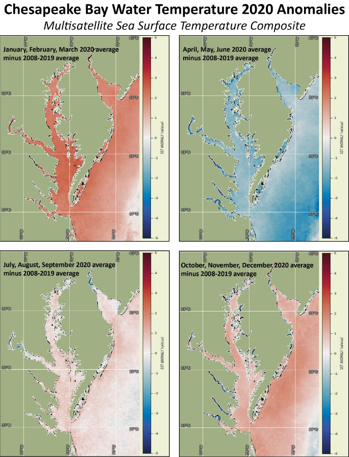
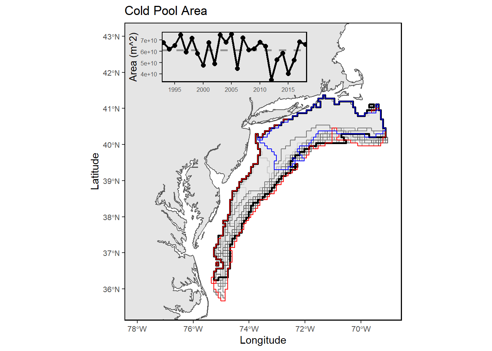
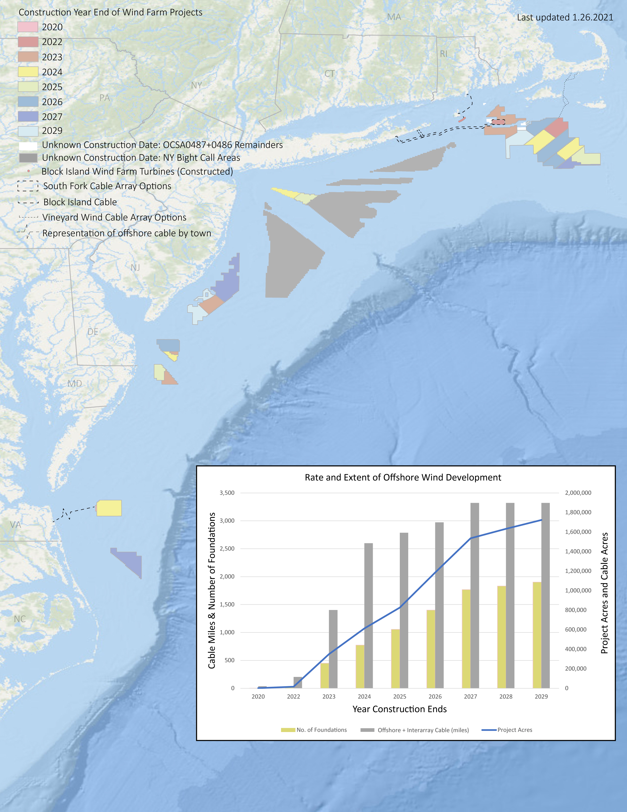
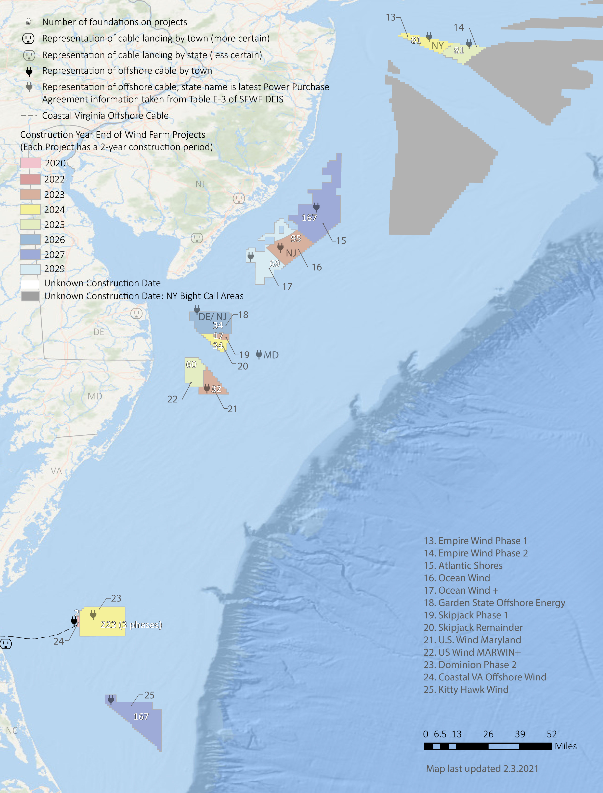

```{r setup, include=FALSE}

# library(tint)
# # invalidate cache when the package version changes
# knitr::opts_chunk$set(tidy = FALSE, cache.extra = packageVersion('tint'))
# options(htmltools.dir.version = FALSE)

#Default Rmd options
knitr::opts_chunk$set(echo = FALSE,
                      message = FALSE,
                      dev = "cairo_pdf",
                      warning = FALSE,
                      fig.width = 4,
                      fig.asp = 0.45,
                      fig.align = 'center'
                      ) #allows for inserting R code into captions

#Plotting and data libraries
#remotes::install_github("noaa-edab/ecodata@0.1.0") #change to 2020 ecodata version for release
library(tidyverse)
library(tidyr)
library(ecodata)
library(here)
library(kableExtra)

```

```{r, code = readLines("https://raw.githubusercontent.com/NOAA-EDAB/ecodata/master/chunk-scripts/human_dimensions_MAB.Rmd-setup.R")}
```

```{r, code = readLines("https://raw.githubusercontent.com/NOAA-EDAB/ecodata/master/chunk-scripts/human_dimensions_MAB.Rmd-GIS-setup.R")}
```

```{r, code = readLines("https://raw.githubusercontent.com/NOAA-EDAB/ecodata/master/chunk-scripts/macrofauna_MAB.Rmd-setup.R")}
```

```{r, code = readLines("https://raw.githubusercontent.com/NOAA-EDAB/ecodata/master/chunk-scripts/LTL_MAB.Rmd-setup.R")}
```

\setcounter{page}{4}

# Introduction

## About This Report

The purpose of this report is to synthesize ecosystem information to better meet fishery management objectives, and to update the MAFMC’s Ecosystem Approach to Fishery Management (EAFM) risk assessment. The major messages of the report are synthesized in the 2-page summary and synthesis themes are illustrated on page 3. The information in this report is organized into two sections; [performance measured against ecosystem-level management objectives](#performance-relative-to-fishery-management-objectives) (Table \ref{tab:management-objectives}), and potential [risks to meeting fishery management objectives](#risks-to-meeting-fishery-management-objectives) (Climate change and Other Ocean Uses).

## Report structure

The two main sections contain subsections for each management objective or potential risk. Within each subsection, we first review indicator trends, and the status of the most recent year relative to a threshold (if available) or relative to the long-term average. Second, we synthesize results of other indicators and information to outline potential implications for management (i.e., connecting indicator(s) status to management and why an indicator(s) is important). For example, if there are multiple drivers related to an indicator trend, which drivers may be more or less supported by current information, and which, if any, can be affected by management action? Similarly, which risk indicators warrant continued monitoring to evaluate whether regime shifts or ecosystem reorganization are likely? We emphasize that these implications are intended to represent testable hypotheses at present, rather than “answers,” because the science behind these indicators and syntheses continues to develop.  

A glossary of terms^[https://noaa-edab.github.io/tech-doc/glossary.html], detailed technical methods documentation^[https://NOAA-EDAB.github.io/tech-doc] and indicator data^[https://github.com/NOAA-EDAB/ecodata] are available online. The details of standard figure formatting (Fig. \ref{fig:docformat}a), categorization of fish and invertebrate species into feeding groups (Table \ref{tab:species-groupings}), and definitions of ecological production units (EPUs, including the Mid-Atlantic Bight, MAB; Fig. \ref{fig:docformat}b) are provided at the end of the document. 

```{r management-objectives}

mng_obj <- data.frame("Objective Categories" = c("Seafood Production",
                                                 "Profits","Recreation",
                                                 "Stability","Social & Cultural",
                                                 "Protected Species",
                                                 "Biomass","Productivity",
                                                 "Trophic structure","Habitat"),
"Indicators reported here" = c("Landings; commercial total and by feeding guild; recreational harvest",
                               "Revenue decomposed to price and volume",
                               "Days fished; recreational fleet diversity",
                               "Diversity indices (fishery and ecosystem)",
                               "Community engagement/reliance status",
                               "Bycatch; population (adult and juvenile) numbers, mortalities",
                               "Biomass or abundance by feeding guild from surveys",
                               "Condition and recruitment of managed species, Primary productivity",
                               "Relative biomass of feeding guilds, Zooplankton",
                               "Estuarine and offshore habitat conditions"))

knitr::kable(mng_obj, linesep = "",
      col.names = c("Objective Categories","Indicators reported here"),
      caption = "Ecosystem-scale fishery management objectives in the Mid-Atlantic Bight",
      #align = 'c',
      booktabs = T) %>%
  kable_styling(latex_options = "hold_position", "scale_down") %>%
 # column_spec(c(2), width = c("25em")) %>%
  row_spec(0, bold = TRUE) %>%
 # group_rows("Provisioning/Cultural", 1,4) %>%
 # group_rows("Supporting/Regulating", 5,9)
  pack_rows("Provisioning/Cultural Services", 1,6) %>%
  pack_rows("Supporting/Regulating Services", 7,10)


```
 
# Performance relative to fishery management objectives

In this section, we examine indicators related to broad, ecosystem-level fishery management objectives. We also provide hypotheses on the implications of these trends—*why* we are seeing them, what’s driving them, and potential or observed regime shifts or changes in ecosystem structure. Identifying multiple drivers, regime shifts, and potential changes to ecosystem structure, as well as identifying the most vulnerable resources, can help managers determine whether we can do anything differently to meet objectives and how to prioritize for upcoming issues/risks.

## Seafood Production 

### Indicators: Landings; total and by feeding guild 
Total commercial landings and MAFMC’s managed landings in the MAB continue to trend downward (Fig. \ref{fig:total-landings}). The downward trend is most significant in the benthos (scallops and clams) group (Fig. \ref{fig:comm-landings}).
```{r, total-landings, fig.cap = paste0("Total commercial seafood landings (black) and ",region," managed seafood landings (red)."), code = readLines("https://raw.githubusercontent.com/NOAA-EDAB/ecodata/master/chunk-scripts/human_dimensions_MAB.Rmd-comdat-total-landings.R"), fig.asp=.35}
```

```{r, comm-landings, fig.cap = paste0("Total commercial landings (black) and ",council_abbr," managed species landings (red) by feeding guild."), code = readLines("https://raw.githubusercontent.com/NOAA-EDAB/ecodata/master/chunk-scripts/human_dimensions_MAB.Rmd-comdat-commercial-landings.R"), fig.asp=1.5}
```

Total recreational harvest (retained fish presumed to be eaten) is also down in the MAB (Fig. \ref{fig:rec-landings}). 
```{r, rec-landings, fig.cap = paste0("Total recreational seafood harvest (millions of fish) in the ",region," region."), code = readLines("https://raw.githubusercontent.com/NOAA-EDAB/ecodata/master/chunk-scripts/human_dimensions_MAB.Rmd-recdat-landings.R")}

```

Recreational shark landings show an increase in pelagic sharks over the past decade, with a sharp decrease in 2018 and 2019 (Fig \ref{fig:rec_hms}). This is likely influenced by regulatory changes implemented in 2018 intended to rebuild shortfin mako stocks. 
```{r rec_hms, fig.cap="Recreational shark landings from Large Pelagics Survey.", code = readLines("https://raw.githubusercontent.com/NOAA-EDAB/ecodata/master/chunk-scripts/human_dimensions_MAB.Rmd-rec_hms.R"), fig.width=5, fig.asp=.35}

```

Aquaculture production is not yet included in total seafood landings, but we are working toward including it in future reports. Available aquaculture production of oysters for a subset of Mid-Atlantic states is trending upward.^[https://noaa-edab.github.io/catalog/aquaculture.html]

### Implications

Declining commercial and recreational landings can be driven by many interacting factors, including combinations of ecosystem and stock production, management actions, market conditions, and environmental change. While we cannot evaluate all possible drivers at present, here we evaluate the extent to which ecosystem overfishing (total landings exceeding ecosystem productive capacity), stock status, and system biomass trends may play a role. 

#### Ecosystem Overfishing Indices 
Thresholds for ecosystem-level overfishing based on system production characteristics have been proposed [@link_global_2019], and are applied here for the MAB.  Based on either the ratio of total landings to total primary production (Fogarty Index, Fig. \ref{fig:fogarty}), or total landings per unit area (Ryther Index, Fig. \ref{fig:ryther}), MAB landings are at or below the proposed thresholds, so ecosystem overfishing is unlikely to be a major factor driving decreased landings. In future reports we may be able to include discards to evaluate total catch. 
```{r fogarty, fig.cap="Fogarty Index; the ratio of total landings to total primary production in an ecosystem. Link and Watson (2019) give an optimal range (green shading) of the Fogarty ratio of 0.22 to 0.92 parts per thousand (PPT). Previous work suggested that index values exceeding 1 to 2 PPT (red shading) led to ecosystem tipping points.", code = readLines("https://raw.githubusercontent.com/NOAA-EDAB/ecodata/master/chunk-scripts/human_dimensions_MAB.Rmd-fogarty.R")}

```

```{r ryther, fig.cap="Ryther index; total landings presented on a unit area basis for an ecosystem. Theoretical estimates (Link and Watson, 2019) imply the index should range from 0.3 - 1.1 mt per sq km annually (green shading) with a limit of 3 mt per sq km annually, above which tipping points could occur in fished ecosystems (red shading). Expected system-wide MSYs can be in the range of 1 to 3 mt per sq km (unshaded).", code = readLines("https://raw.githubusercontent.com/NOAA-EDAB/ecodata/master/chunk-scripts/human_dimensions_MAB.Rmd-ryther.R")}
```

The amount of potential yield we can expect from a marine ecosystem depends on the amount of production entering at the base of the food web, primarily in the form of phytoplankton; the pathways this energy follows to reach harvested species; the efficiency of transfer of energy at each step in the food web; and the fraction of this production that is removed by the fisheries. Fisheries catches are sustained by a lower proportion of the ecosystem's primary production now than in the past, particularly when compared with the 1970s when each of these indices suggest that ecosystem overfishing may have occurred (Fig. \ref{fig:ppr-mab}).
```{r ppr-mab, fig.cap="Primary production required to support MAB commercial landings. Included are the top species accounting for 80\\% of the landings in each year, with 15\\% transfer efficiency assumed between trophic levels. PPD is total primary production. The solid line is based on satellite-derived PPD and the dashed line is based on reconstructed PPD.", code = readLines("https://raw.githubusercontent.com/NOAA-EDAB/ecodata/master/chunk-scripts/human_dimensions_MAB.Rmd-ppr.R")}
```

#### Stock Status
Single species management objectives of maintaining biomass above minimum thresholds and fishing mortality below limits are being met for all but two MAFMC managed species, though the status of six stocks is unknown (Fig. \ref{fig:stock-status}). Therefore, stock status and associated management constraints are unlikely to be driving decreased landings. To better address the role of management in future reports, we could examine how the total allowable catch (TAC) and the percentage of the TAC taken for each species has changed through time. 
```{r stock-status, fig.cap = paste0("Summary of single species status for ",council_abbr," and jointly federally managed stocks (Goosefish and Spiny dogfish)."), code = readLines("https://raw.githubusercontent.com/NOAA-EDAB/ecodata/master/chunk-scripts/human_dimensions_MAB.Rmd-stock-status.R"), fig.width = 7.5, fig.asp = 0.5}
```

#### System Biomass
Although aggregate biomass trends derived from scientific resource surveys are mostly stable in the MAB, spring piscivores and fall benthos show long-term increases (Fig. \ref{fig:nefsc-biomass-mab}). The NEAMAP Fall 2020 survey was completed and is included here; NEFSC surveys were not completed in 2020. While managed species make up varying proportions of aggregate biomass, trends in landings are not mirroring shifts in the overall trophic structure of survey-sampled fish and invertebrates. 
```{r nefsc-biomass-mab, fig.cap = "Spring (left) and fall (right) surveyed biomass in the Mid-Atlantic Bight. Data from the NEFSC Bottom Trawl Survey are shown in black, with NEAMAP shown in red. The shaded area around each annual mean represents 2 standard deviations from the mean.", code = readLines("https://raw.githubusercontent.com/NOAA-EDAB/ecodata/master/chunk-scripts/macrofauna_MAB.Rmd-aggregate-biomass.R"), fig.width=8, fig.asp = 0.75}
```

#### Effect on Seafood Production
Because ecosystem overfishing seems unlikely, stock status is mostly acceptable, and aggregate biomass trends appear stable, the decline in commercial landings is most likely driven by market dynamics affecting the landings of surfclams and ocean quahogs, as quotas are not binding for these species. 

Climate change also seems to be shifting the distribution of surfclams and ocean quahogs, resulting in areas with overlapping distributions and increased mixed landings. Given the regulations governing mixed landings, this could become problematic in the future and is currently being evaluated by the Council. 

The decline in recreational seafood landings stems from other drivers.  Some of the decline, such as that for recreational shark landings, is driven by management intended to reduce fishing mortality on mako sharks. However, NOAA Fisheries’ Marine Recreational Information Program survey methodology was updated in 2018, so it is unclear whether the record-low landings for species other than sharks in 2018 are driven by changes in fishing behavior or the change in the survey methodology.  

Other environmental changes require monitoring as they may become important drivers of landings in the future:
 
- Climate is trending into uncharted territory. Globally, 2020 was tied with the warmest year on record^[https://www.nasa.gov/press-release/2020-tied-for-warmest-year-on-record-nasa-analysis-shows] with regional marine heatwaves apparent (see [Climate Risks section](#climate-and-ecosystem-productivity)).   
- Stocks are shifting distribution, moving towards the northeast and into deeper waters throughout the Northeast US Large Marine Ecosystem (Fig. \ref{fig:species-dist}).  
  
```{r species-dist, fig.cap = "Aggregate species distribution metrics for species in the Northeast Large Marine Ecosystem.", code = readLines("https://raw.githubusercontent.com/NOAA-EDAB/ecodata/master/chunk-scripts/macrofauna_MAB.Rmd-species-dist.R"), fig.asp=.9}
```  

- Some ecosystem composition and production changes have been observed (see [Stability section](#stability)). 
- Fishing engagement has declined in some communities (see [Social and Cultural section](#social-and-cultural)).  

## Commercial Profits 

### Indicators: revenue (a proxy for profits), with price and volume components  
Total commercial revenue (black) has increased over the long term, but the trend may be reversing, with recent total revenue below the long-term average (Fig. \ref{fig:comm-revenue}). The MAFMC-managed species revenue (red) has continued its downward trend, with recent years near a time-series low. 
```{r comm-revenue, fig.width = 4, fig.asp = 0.45, fig.cap = "Total revenue for the region (black) and revenue from MAFMC managed species (red).", code = readLines("https://raw.githubusercontent.com/NOAA-EDAB/ecodata/master/chunk-scripts/human_dimensions_MAB.Rmd-comdat-comm-revenue.R")}
```

Revenue earned by harvesting resources is a function of both the quantity landed of each species and the prices paid for landings. Beyond monitoring yearly changes in revenue, it is even more valuable to determine what drives these changes:  harvest levels, the mix of species landed, price changes, or a combination of these. The Bennet Indicator decomposes revenue change into two parts, one driven by changing quantities (volumes), and a second driven by changing prices.

Total revenue trends, decomposed to price and volume indicators (Fig. \ref{fig:bennet}), mirror price and volume indicator trends for the benthos (clams and scallops; orange in Fig. \ref{fig:bennet-all}) group, especially over the past decade. 
```{r bennet, fig.cap = paste0("Revenue change from the 2015 values in dollars (black), Price (PI), and Volume Indicators (VI) for commercial landings in the Mid-Atlantic Bight."), code = readLines("https://raw.githubusercontent.com/NOAA-EDAB/ecodata/master/chunk-scripts/human_dimensions_MAB.Rmd-bennet.R"), fig.width=6, fig.asp=.35}
```

```{r bennet-all, fig.cap = "Total component value in dollars (black) for commercial landings in the Mid-Atlantic Bight.", code = readLines("https://raw.githubusercontent.com/NOAA-EDAB/ecodata/master/chunk-scripts/human_dimensions_MAB.Rmd-bennet-all.R"), fig.width = 7.5, fig.asp = 0.35}
```

### Implications 
The Bennet indicator demonstrates that increasing total revenue early in the time series is due to increasing quantities landed, which offset declining prices. Recent declines in prices contributed to falling revenue as quantities landed did not increase enough to counteract declining prices. 

Changes in other indicators, particularly those driving landings and those related to climate change, require monitoring as they may become important drivers of revenue in the future; for example:

-  Surfclams and ocean quahogs are sensitive to warming ocean temperatures and ocean acidification.   
-  Acidification levels in surfclam summer habitat are approaching, but not yet at, levels affecting surfclam growth (see [Climate Risks section](#climate-and-ecosystem-productivity)).  

## Recreational Opportunities 

### Indicators: Angler trips, fleet diversity  
Recreational effort (angler trips) has no significant long term trend, with current effort near the long-term average (Fig. \ref{fig:rec-op}). However, recreational fleet diversity has declined over the long term (Fig. \ref{fig:rec-div}). 
```{r rec-op, fig.cap = paste0("Recreational effort in the ",region,"."), code = readLines("https://raw.githubusercontent.com/NOAA-EDAB/ecodata/master/chunk-scripts/human_dimensions_MAB.Rmd-recdat-effort.R")}
```

```{r rec-div, fig.cap = paste0("Recreational fleet effort diversity in the ",region,"."), code = readLines("https://raw.githubusercontent.com/NOAA-EDAB/ecodata/master/chunk-scripts/human_dimensions_MAB.Rmd-recdat-diversity.R")}

```

### Implications
The absence of a long-term trend in recreational effort suggests relative stability in the overall number of recreational opportunities in the MAB. However, the decline in recreational fleet diversity suggests a potentially reduced range of opportunities. 

The downward effort diversity trend is driven by party/charter contraction (from a high of 24% of angler trips to 7% currently), and a shift toward shorebased angling. Effort in private boats remained stable between 36-37% of angler trips across the entire series.

Changes in recreational fleet diversity can be considered when managers seek options to maintain recreational opportunities. Shore anglers will have access to different species and when the same species, typically smaller fish. Many states have developed shore based regulations where the minimum size is lower than in other areas and sectors to maintain opportunities in the shore angling sector. 


## Stability 

### Indicators: fishery fleet and catch diversity, ecological component diversity 
While there are many potential metrics of stability, we use diversity indices as a first check to evaluate overall stability in fisheries and ecosystems. In general, diversity that remains constant over time suggests a similar capacity to respond to change over time. A significant change in diversity over time does not necessarily indicate a problem or an improvement, but does indicate a need for further investigation. We examine commercial and recreational fleet and species catch diversity, and diversity in zooplankton, larval, and adult fish. 

#### Fishery Diversity 
Diversity estimates have been developed for fleets and species landed by vessels with Mid-Atlantic permits. A fleet is defined here as the combination of gear type (Scallop Dredge, Other Dredge, Gillnet, Hand Gear, Longline, Bottom Trawl, Midwater Trawl, Pot, Purse Seine, or Clam Dredge) and vessel length category (Less than 30 ft, 30 to 50 ft, 50 to 75 feet, 75 ft and above). Commercial fishery fleet count and fleet diversity have been stable over time in the MAB, with current values near the long-term average (Fig. \ref{fig:commercial-div}). This indicates similar commercial fleet composition and species targeting opportunities over time. 
```{r commercial-div, fig.cap = paste0("Fleet diversity and fleet count in the ",region,"."), code = readLines("https://raw.githubusercontent.com/NOAA-EDAB/ecodata/master/chunk-scripts/human_dimensions_MAB.Rmd-commercial-div.R"), fig.asp=.9}
```

Commercial fisheries are relying on fewer species relative to the mid-90s, but current species revenue diversity has been consistent since then and is currently near the long term average (Fig. \ref{fig:commercial-div-species-div}). 
```{r commercial-div-species-div,  fig.cap = paste0("Species revenue diversity in the ",region,"."), code = readLines("https://raw.githubusercontent.com/NOAA-EDAB/ecodata/master/chunk-scripts/human_dimensions_MAB.Rmd-commercial-div-species-div.R")}
```

As noted [above](#recreational-opportunities) recreational fleet effort diversity is unstable (declining; Fig. \ref{fig:rec-div}). However, recreational species catch diversity is stable and has been at or above the long term average in 7 of the last 10 years (Fig. \ref{fig:recdat-div-catch}). 
```{r recdat-div-catch, fig.cap = paste0("Diversity of recreational catch in the ",region,"."), code = readLines("https://raw.githubusercontent.com/NOAA-EDAB/ecodata/master/chunk-scripts/human_dimensions_MAB.Rmd-recdat-div-catch.R")}
```

#### Ecological Diversity

Ecological diversity indices show mixed trends. Zooplankton diversity is increasing in the MAB (Fig. \ref{fig:zoo-diversity}). Adult fish diversity is measured as the expected number of species in a standard number of individuals sampled from the NEFSC bottom trawl survey. There is no vessel correction for this metric, so Albatross and Bigelow years are calculated separately. Larval fish and adult fish diversity indices are stable over time, with current values near the long-term average (Figs. \ref{fig:ichthyo-diversity}, \ref{fig:exp-n}). 
```{r zoo-diversity, fig.cap = "Zooplankton diversity in the Mid-Atlantic Bight, based on Shannon diversity index.", code = readLines("https://raw.githubusercontent.com/NOAA-EDAB/ecodata/master/chunk-scripts/LTL_MAB.Rmd-zoo-diversity.R")}
```

```{r ichthyo-diversity, fig.cap = "Larval fish diversity in the Mid-Atlantic Bight, based on Shannon diversity index.", code = readLines("https://raw.githubusercontent.com/NOAA-EDAB/ecodata/master/chunk-scripts/macrofauna_MAB.Rmd-ichthyo-diversity.R")}
```

```{r exp-n, fig.cap = "Adult fish diversity the Mid-Atlantic Bight, based on expected number of species.", code = readLines("https://raw.githubusercontent.com/NOAA-EDAB/ecodata/master/chunk-scripts/macrofauna_MAB.Rmd-exp-n.R"), fig.width=5, fig.asp=.4}
```

 
### Implications
Fleet diversity indices are used by the MAFMC to evaluate stability objectives as well as risks to fishery resilience and maintaining equity in access to fishery resources [@gaichas_implementing_2018]. 

Stability in commercial fleet diversity metrics suggests stable capacity to respond to the current range of fishing opportunities. 

Declining recreational fleet effort diversity, as noted [above](#recreational-opportunities), indicates that the party/charter boat sector continues to contract, with shoreside angling becoming more important, as a percentage of recreational days fished.

Stability in recreational species catch diversity has been maintained by a different set of species over time. A recent increase in ASMFC and SAFMC managed species in recreational catch is helping to maintain diversity in the same range that MAFMC and NEFMC species supported in the 1990s.

Ecological diversity indices can provide insight into ecosystem structure. Changes in ecological diversity over time may indicate altered ecosystem structure with implications for fishery productivity and management [@friedland_changes_2020].

Increasing zooplankton diversity is driven by the declining dominance of the calanoid copepod *Centropages typicus*, with a similar composition of other zooplankton species. 

Stable larval and adult fish diversity indicates the same overall number and evenness over time, but doesn’t rule out species substitutions (e.g., warm-water replacing cold-water). While larval fish diversity is near the long-term mean, the dominance of a few warm-southern taxa has increased. Stable but variable larval diversity can indicate interannual changes in a dominant species.  

In the MAB, existing diversity indicators suggest overall stability in the fisheries and ecosystem components examined. However, declining recreational fleet diversity suggests a potential loss in the range of recreational fishing opportunities, and increasing zooplankton diversity is due to the declining dominance of an important species, suggesting change in the zooplankton community that warrants continued monitoring to determine if managed species are affected. 

## Social Vulnerability 

### Indicators: Social vulnerability in commercial and recreational fishing communities
Social vulnerability measures social factors that shape a community’s ability to adapt to change and does not consider gentrification pressure vulnerability. Communities that ranked medium-high or above for one or more of the following indicators: poverty, population composition, personal disruption, or labor force structure, are highlighted in red. 

Commercial fishery engagement measures the number of permits, dealers, and landings in a community, while reliance expresses these numbers based on the level of fishing activity relative to the total population of a community.  
In 2020, we reported that the number of highly engaged Mid-Atlantic commercial fishing communities had declined over time, and engagement scores had also declined in medium-highly engaged communities. Here we focus on the top ten most engaged, and top ten most reliant commercial fishing communities and their associated  social vulnerability (Fig. \ref{fig:commercial-engagement}).  Barnegat Light and Cape May, NJ, and Reedville, VA are highly engaged and reliant with medium-high to high social vulnerability.   
```{r commercial-engagement, fig.cap= "Commercial engagement, reliance, and social vulnerability for the top commercial fishing communities in the Mid-Atlantic.", code = readLines("https://raw.githubusercontent.com/NOAA-EDAB/ecodata/master/chunk-scripts/human_dimensions_MAB.Rmd-commercial-engagement.R"), fig.width = 6.5, fig.asp = 0.75}
```

Recreational fishery engagement measures shore, private vessel, and for-hire fishing activity while reliance expresses these numbers based on fishing effort relative to the population of a community. Of the nine recreational communities that are most engaged and reliant, Avon, Ocracoke and Hatteras, NC and Barnegat Light and Cape May, NJ scored medium-high or above for social vulnerability (Fig. \ref{fig:recreational-engagement}). 

Both commercial and recreational fishing are important activities in  Montauk, NY; Barnegat Light, Cape May, and Point Pleasant Beach, NJ; and Ocracoke and Rodanthe, NC, meaning some of these communities may be impacted simultaneously by commercial and recreational regulatory changes. Of these communities, three scored medium-high or above for social vulnerability.

```{r recreational-engagement, fig.cap= "Recreational engagement, reliance, and social vulnerability for the top recreational fishing communities in the Mid-Atlantic.", code = readLines("https://raw.githubusercontent.com/NOAA-EDAB/ecodata/master/chunk-scripts/human_dimensions_MAB.Rmd-recreational-engagement.R"), fig.width = 6.5, fig.asp = 0.75}
```


### Implications
These plots provide a snapshot of the relationship between social vulnerability and the most highly engaged and most highly reliant commercial and recreational fishing communities in the Mid-Atlantic. Similar plots are used to inform the annual California Current Ecosystem Status Report. These communities may be vulnerable to changes in fishing patterns due to regulations and/or climate change. When any of these communities are also experiencing social vulnerability, they may have lower ability to successfully respond to change. These indicators may also point to communities that are vulnerable to environmental justice issues. Additional analysis related to ecosystem shifts and National Standard 8 of the Magnuson-Stevens Act is ongoing. 


## Protected Species
Protected species include marine mammals protected under the Marine Mammal Protection Act, endangered and threatened species protected under the Endangered Species Act, and migratory birds protected under the Migratory Bird Treaty Act. In the Northeast U.S., endangered/threatened species include Atlantic salmon, Atlantic and shortnose sturgeon, all sea turtle species, and five baleen whales. Fishery management objectives for protected species generally focus on reducing threats and on habitat conservation/restoration; here we report on the status of these actions as well as indicating the potential for future interactions driven by observed and predicted ecosystem changes in the Northeast U.S. region.
Protected species objectives include managing bycatch to remain below potential biological removal (PBR) thresholds, recovering endangered populations, and monitoring unusual mortality events (UMEs).

### Indicators: bycatch, population (adult and juvenile) numbers, mortalities
Average indices for both harbor porpoise (Fig. \ref{fig:harborporpoise}) and gray seal bycatch (Fig. \ref{fig:grayseal}) are below current PBR thresholds, meeting management objectives. However, the 2019 bycatch estimate for gray seals was highest in the time series.
```{r harborporpoise, fig.cap="Harbor porpoise average bycatch estimate for Mid-Atlantic and New England fisheries (blue) and the potential biological removal (red). 2019 estimates are preliminary.", code = readLines("https://raw.githubusercontent.com/NOAA-EDAB/ecodata/master/chunk-scripts/macrofauna_MAB.Rmd-harborporpoise.R"), fig.width=6}
```

```{r grayseal, fig.cap="Gray Seal average bycatch estimate for New England gillnet fisheries (blue) and and the potential biological removal (red). 2019 estimates are preliminary.", code = readLines("https://raw.githubusercontent.com/NOAA-EDAB/ecodata/master/chunk-scripts/macrofauna_MAB.Rmd-grayseal.R"), fig.width=6}
```

The North Atlantic right whale population was on a recovery trajectory until 2010, but has since declined (Fig. \ref{fig:narw-abundance}). Reduced survival rates of adult females and diverging abundance trends between sexes have also been observed. It is estimated that there are only about 100 adult females remaining in the population. 
```{r narw-abundance, fig.cap = "Estimated North Atlanic right whale abundance on the Northeast Shelf.", code = readLines("https://raw.githubusercontent.com/NOAA-EDAB/ecodata/master/chunk-scripts/macrofauna_MAB.Rmd-narw-abundance.R")}
```
North Atlantic right whale calf counts have also been declining (Fig. \ref{fig:NARW-calf-abundance}). In 2018 there were zero observed new calves, and a drop in annual calves roughly mirrors the abundance decline, however seven new calves were born in 2019. Preliminary 2020 observations of 12 calves have been recorded as of January 2021.  
```{r NARW-calf-abundance, fig.cap = "Number of North Atlantic right whale calf births, 1990 - 2019.", code = readLines("https://raw.githubusercontent.com/NOAA-EDAB/ecodata/master/chunk-scripts/macrofauna_MAB.Rmd-NARW-calf-abundance.R")}
```

This year, four Unusual Mortality Events (UMEs) continued, three for large whales (North Atlantic right whales, humpback whales, and minke whales) and one for gray and harbor seals.

Since 2017, the total UME right whale mortalities includes 32 dead stranded whales, 11 in the US and 21 in Canada. When alive but seriously injured whales (14) are taken into account, 46 individual whales are included in the UME. During 2020 two mortalities were documented, however, recent research suggests that many mortalities go unobserved and the true number of mortalities are about three times the count of the observed mortalities [@pace_cryptic_2021]. The primary cause of death is “human interaction” from entanglements or vessel strikes. 

Coastal bottlenose dolphin stocks off North Carolina and Virginia are listed as depleted, so a take reduction team met in 2019 and has been evaluating and implementing some of the team's consensus recommendations. 

Also, a UME for both gray and harbor seals was declared in 2018 due to a high number of mortalities thought to be caused by phocine distemper virus.

### Implications
Bycatch management measures have been implemented to maintain bycatch below thresholds. The downward trend in harbor porpoise bycatch can also be due to a decrease in  harbor porpoise abundance in US waters, which has reduced fisheries overlap; and a decrease in gillnet effort. The increasing trend in gray seal bycatch may be related to an increase in the gray seal population (U.S. pup counts).

The number of gray seals in U.S. waters has risen dramatically in the last three  decades. Based on a survey conducted in 2016, the size of the gray seal population in the U.S. during the breeding season was approximately 27,000 animals, while in Canada the population,was estimated to be roughly 425,000. A survey conducted in 2021 in both countries will provide updated estimates of abundance. The population in Canada is increasing at roughly 4% per year, and contributing to rates of increase in the U.S., where the number of pupping sites has increased from 1 in 1988 to 9 in 2019. Mean rates of increase in the number of pups born at various times since 1988 at four of the more data-rich pupping sites (Muskeget, Monomoy, Seal, and Green Islands) ranged from -0.2% (95\%CI: -2.3 - 1.9\%) to 26.3% (95\%CI: 21.6 - 31.4\%). These high rates of increase provide further support for the hypothesis that seals from Canada are continually supplementing the breeding population in U.S. waters.  

Strong evidence exists to suggest that interactions between right whales and the offshore lobster gear in the U.S. and snow crab gear in Canada is contributing substantially to the decline of the species. Further, right whale distribution has changed since 2010. The reasons for these changes is unclear, but changes in climate and the distribution of their primary prey (*Calanus finmarchicus*) are suspected causes.

The UMEs are under investigation and are likely the result of multiple drivers. For all three large whale UMEs, human interaction appears to have contributed to increased mortalities, although investigations are not complete. An investigation into the cause of the seal UME so far suggests phocine distemper virus as a potential cause. 

A marine mammal climate vulnerability assessment is currently underway for Atlantic and Gulf of Mexico populations and will be reported on in future versions of this report.


# Risks to meeting fishery management objectives

## Climate and Ecosystem Productivity

### Climate Change Indicators: ocean currents, temperature, heatwaves, acidification
Regional ocean current indicators remain at unprecedented levels. In 2019, the Gulf Stream  was at its most northern position since 1993 (Fig. \ref{fig:GSI}). A more northerly Gulf Stream position is associated with warmer ocean temperature on the Northeast US shelf [@zhang_role_2007], a higher proportion of Warm Slope Water in the Northeast Channel, and increased sea surface height along the U.S. east coast [@goddard_extreme_2015]. 
```{r GSI, fig.cap = "Index representing changes in the location of the Gulf Stream north wall. Positive values represent a more northerly Gulf Stream position.", code=readLines("https://raw.githubusercontent.com/NOAA-EDAB/ecodata/master/chunk-scripts/LTL_MAB.Rmd-gsi.R")}
```
In 2019, we also observed the second lowest proportion of Labrador Shelf water entering the Gulf of Maine since 1978 (Fig. \ref{fig:wsw-prop}). The changing proportions of source water affect the temperature, salinity, and nutrient inputs to the Gulf of Maine ecosystem.
```{r wsw-prop, fig.cap = "Proportion of Warm Slope Water (WSW) and Labrador slope water (LSLW) entering the GOM through the Northeast Channel.", code=readLines("https://raw.githubusercontent.com/NOAA-EDAB/ecodata/master/chunk-scripts/LTL_NE.Rmd-slopewater.R"), fig.width=5, fig.asp=.35}
```
Ocean temperatures continue to warm at both the bottom (Fig. \ref{fig:bottom-temp}) and the surface (Fig. \ref{fig:seasonal-sst-anom-gridded}). Warming is not seasonally uniform, however: spring 2020 was cooler than average on portions of the shelf. 
```{r bottom-temp, fig.cap="Annual bottom temperature in the Mid-Atlantic Bight. (black = observations, red = reanalysis)", code=readLines("https://raw.githubusercontent.com/NOAA-EDAB/ecodata/master/chunk-scripts/LTL_MAB.Rmd-bottom-temp.R")}
```

```{r seasonal-sst-anom-gridded, fig.cap="MAB seasonal sea surface temperature time series overlaid onto 2020 seasonal spatial anomalies.", code=readLines("https://raw.githubusercontent.com/NOAA-EDAB/ecodata/master/chunk-scripts/LTL_MAB.Rmd-seasonal-sst-anom-gridded.R"), fig.width = 8, fig.asp = .875}
```

The Chesapeake Bay also experienced a warmer-than-average winter and a cooler-than-average spring in 2020, relative to the previous decade. Water temperatures returned to average during the summer and were slightly above average from October through December (Fig. \ref{fig:ches-temp}).
```{r ches-temp, out.width='50%', fig.cap="Chesapeake Bay sea surface temperature (SST) seasonal spatial anomalies for 2020, from NOAA multisatellite SST composite. Positive values (red) above 2008-2019 average; negative values (blue) below 2008-2019 average. A) Jan, Feb, Mar; B) Apr, May, Jun; C) Jul, Aug, Sep; D) Oct, Nov, Dec."}

```


The MAB experienced frequent ocean heatwaves of moderate intensity in 2020 that extended well into December, as observed in Chesapeake Bay (Fig. \ref{fig:heatwave-year}).
```{r heatwave-year, fig.cap="Marine heatwave events (red) in the Mid-Atlantic occuring in 2020.", code=readLines("https://raw.githubusercontent.com/NOAA-EDAB/ecodata/master/chunk-scripts/LTL_MAB.Rmd-heatwave-year.R"), fig.width=5, fig.asp=.6}
```

Changes in ocean temperature and circulation alter habitat features such as the cold pool, a 20–60 m thick band of cold, relatively uniform near‐bottom water that persists from spring to fall over the mid-shelf and outer shelf of the Middle Atlantic Bight (MAB) and Southern Flank of Georges Bank [@lentz_seasonal_2017]. The cold pool plays an essential role in the structuring of the MAB ecosystem.  It is a reservoir of nutrients that feeds phytoplankton productivity, is essential fish spawning and nursery habitat, and affects fish distribution and behavior [@lentz_seasonal_2017]. The average temperature of the cold pool has been getting warmer over time, calculated based on [@miller_state-space_2016]).  These changes can affect distribution and migration timing for species that depend on the cold pool habitat.  The area of the MAB cold pool was near average in 2018 (Fig. \ref{fig:cold-pool-map}).  The size of the cold pool varies annually, with the smallest sizes associated with record-warm years (e.g. 2012). The cold pool temperature shows a similar variation as its extent, both of which are strongly impacted by each early spring setting in temperature on the shelf.
```{r cold-pool-map, eval = T, echo = F, fig.cap="Map of cold pool area. Time series of cold pool spatial extent FROM 1993-2018. Black = 2018 (Last year in time series), Red = 2012 Minimum area, Blue = 2005 Maximum area." }
#code=readLines("https://raw.githubusercontent.com/NOAA-EDAB/ecodata/master/chunk-scripts/LTL_MAB.Rmd-cold_pool_map.R"),

```

New glider-based observations revealed areas of low pH (7.8) during summer in Mid-Atlantic habitats occupied by Atlantic surfclams and sea scallops (Fig. \ref{fig:mab-oa}) (Wright-Fairbanks et al. 2020). This seasonal pH minimum is associated with cold-pool subsurface and bottom water, which is cut off from mixing with surface water by strong stratification. However, seawater pH in shelf waters increased during the fall mixing period due to the influence of a slope water mass characterized by warm, salty, highly alkaline seawater. Lower pH in nearshore waters is likely associated with freshwater input. 

```{r mab-oa, fig.cap = " Seasonal glider-based pH observations on the Mid-Atlantic Bight shelf (New Jersey cross-shelf transect) in relation to Atlantic surfclam and Atlantic sea scallop habitats (modified from Wright-Fairbanks et al. 2020).", out.width='70%'}
#knitr::include_url("https://github.com/NOAA-EDAB/ecodata/raw/master/docs/images/Seasonal%20pH%20on%20MAB%20shelf%20-%20Grace%20Saba.jpg")

knitr::include_graphics("images/Seasonal pH on MAB shelf - Grace Saba.jpg")
```

### Ecosystem Productivity Indicators: primary production, zooplankton, forage fish, fish condition
Increased temperatures, as reported above, can increase the rate of photosynthesis by phytoplankton (i.e. primary productivity). Annual primary production has increased over time, primarily driven by increased productivity in the summer months (Figs. \ref{fig:pp-monthly}, \ref{fig:chl-weekly}).
```{r pp-monthly,  fig.cap="Monthly primary production trends show the annual cycle (i.e. the peak during the summer months) and the changes over time for each month.", code=readLines("https://raw.githubusercontent.com/NOAA-EDAB/ecodata/master/chunk-scripts/LTL_MAB.Rmd-pp-monthly.R"), fig.width=8}
```

Larger-than-average phytoplankton blooms were observed from late fall into winter in 2020 (Fig. \ref{fig:chl-weekly}).
```{r chl-weekly, fig.cap = "Weekly chlorophyll concentrations and primary productivity in the Mid-Atlantic are shown for by the colored line for 2020. The long-term mean is shown in black and shading indicates +/- 1 sample SD.", code=readLines("https://raw.githubusercontent.com/NOAA-EDAB/ecodata/master/chunk-scripts/LTL_MAB.Rmd-chl-weekly.R"), fig.width = 5, fig.asp = 0.9}
```

Climatology of seasonal phytoplankton size fractions confirms that the phytoplankton community in the summer is dominated by smaller size classes (pico and nano; Fig. \ref{fig:weekly-phyto-size}). 
```{r weekly-phyto-size, fig.cap=" ", code=readLines("https://raw.githubusercontent.com/NOAA-EDAB/ecodata/master/chunk-scripts/LTL_MAB.Rmd-weekly-phyto-size.R"), fig.asp=.6}
```

This implies less efficient transfer of primary production to higher trophic levels. 

Trends in gelatinous zooplankton and krill are the same across ecological production units (EPUs) as last year (data were updated to 2019; Fig. \ref{fig:zoo-strat-abun}). There has been a long term increase in almost all regions. 
```{r zoo-strat-abun, fig.cap="Stratified abundance of cnidarians and euphausiids in Mid-Atlantic Bight.", code=readLines("https://raw.githubusercontent.com/NOAA-EDAB/ecodata/master/chunk-scripts/LTL_MAB.Rmd-zoo-strat-abun.R"), fig.width=8, fig.asp=.25}
```

Larger zooplankton (i.e. *Calanus finmarchicus*) had above average abundance in 2018-2019 (Fig. \ref{fig:zoo-abund}). 
```{r zoo-abund,  fig.cap= "Large (red) and small-bodied (blue) copepod abundance in the Mid-Atlantic Bight.", code=readLines("https://raw.githubusercontent.com/NOAA-EDAB/ecodata/master/chunk-scripts/LTL_MAB.Rmd-zoo-abund.R")}
```

An index of aggregate forage fish fluctuations (forage anomaly) constructed from zooplankton and ichthyoplankton data has no apparent trend in MAB, but appears to be more variable since 2010 (Fig. \ref{fig:forage-anomaly}).  Changes in environmental conditions, lower tropic levels, and diversity of the plankton community are potentially impacting the prey of zooplankton and ichthyoplankton. 
```{r forage-anomaly, fig.cap=" ", code=readLines("https://raw.githubusercontent.com/NOAA-EDAB/ecodata/master/chunk-scripts/macrofauna_MAB.Rmd-forage-anomaly.R")}
```

Nutritional value (energy content) of forage fishes as prey is related to both environmental conditions, fish growth and reproductive cycles. Forage energy density measurements from NEFSC trawl surveys 2017-2019 are building toward a time series to evaluate trends (Fig. \ref{fig:energy-density}). New 2019 measurements were consistent with last year’s report: the energy density of Atlantic herring was almost half the value (5.69 +/- 0.07 kJ/g wet weight) reported in earlier studies (10.6-9.4 kJ/ g wet weight). Silver hake, sandlance, longfin squid (*Loligo* below) and shortfin squid (*Illex* below) were also lower than previous estimates [@steimle_energy_1985; @lawson_important_1998]. Energy density of alewife, butterfish and Atlantic mackerel show seasonal differences, but bracketing estimates from  previous decades. 
```{r energy-density, fig.cap=" ", code=readLines("https://raw.githubusercontent.com/NOAA-EDAB/ecodata/master/chunk-scripts/macrofauna_MAB.Rmd-energy-density.R"), fig.width = 7.5, fig.asp = 0.5}
```

The health and well being of individual fish can be related to morphometric condition indices (i.e. weight at a given length) such as relative condition index which is the ratio of observed weight to predicted weight based on length (Le Cren 1951). Heavier and fatter fish at a given length have higher relative condition which is expected to influence growth, reproductive output and survival. A pattern of generally good condition was observed across many MAB species prior to 2000, followed by a period of generally poor condition from 2001-2010, with a mix of good and poor condition 2011-2019. While there were no new data to update the condition indicator this year, preliminary analyses show that temperature and zooplankton changes influence the condition of different fish species (Fig. \ref{fig:cond-drivers}). Potential links between fish condition,  fisheries, and markets are under investigation. 
```{r cond-drivers, fig.cap="GAM fish condition deviance explained by environmental variables, with darker cells indicating more important variables for that species.", out.width='60%'}
#knitr::include_url("https://github.com/NOAA-EDAB/ecodata/raw/master/docs/images/condition_proj.png")
knitr::include_graphics("images/Condition_table.png")
```


### Ecosystem Structure Indicators: distribution shifts, diversity, predators
As noted in the [Landings Implications section above](#landings), stocks are shifting distribution throughout the region. In aggregate, fish stocks are moving northeast along the shelf and into deeper waters.

Zooplankton diversity is increasing in the MAB, while larval fish and adult fish diversity indices are stable over time with current values near the long-term average (see [Diversity Indicators section, above](#diversity)).  

New indicators for shark populations, combined with information on gray seals (see [Protected Species Implications section, above](#protected-species)), suggests predator populations are stable (sharks, Figs. \ref{fig:observed-sharks}, \ref{fig:hms-cpue-sharks}) to increasing (seals) in the MAB. Stable predator populations suggest stable predation pressure on managed species, but increasing predator populations may reflect increasing predation pressure.

```{r observed-sharks, fig.cap=" ", code=readLines("https://raw.githubusercontent.com/NOAA-EDAB/ecodata/master/chunk-scripts/macrofauna_MAB.Rmd-observed-sharks.R")}
```

```{r hms-cpue-sharks, fig.cap=" ", code=readLines("https://raw.githubusercontent.com/NOAA-EDAB/ecodata/master/chunk-scripts/macrofauna_MAB.Rmd-hms-cpue-sharks.R")}
```

As noted in the [Protected Species section](#protected-species), gray seal populations are increasing. Harbor and gray seals occupying New England waters are generalist predators that consume more than 30 different prey species. An evaluation of hard  parts found in seal stomachs showed that harbor and gray seals predominantly exploit abundant demersal fish species (i.e. red, white and silver hake). Other relatively abundant prey species found in hard-part remains include sand lance, yellowtail flounder, four-spotted flounder, Gulf-stream flounder, haddock, herring, redfish, and squids. 

A recent stable isotope study utilizing gray seal scat samples obtained from Massachusetts habitats showed individual gray seals can specialize on particular prey. It also found that gray seals vary their diet seasonally, focusing on demersal inshore species prior to the spring molt, and offshore species such as sand lance after molting. DNA studies on gray seal diet in Gulf of Maine and Massachusetts waters found spiny dogfish and Jonah crab present in gray seal scat samples. Skate and crab remains were also found in gray seal stomach remains. In contrast to direct feeding, it is uncertain if the presence of skates and crabs is due to secondary consumption or scavenging. 


### Habitat Climate Vulnerability
A recent habitat climate vulnerability analysis links black sea bass, scup, and summer flounder to several highly vulnerable nearshore habitats from salt marsh through shallow estuarine and marine reefs. Details on highly vulnerable habitats with linkages to a variety of species, including which life stages have different levels of dependence on a particular habitat, are available in a detailed table^[https://noaa-edab.github.io/ecodata/Hab_table].

### Implications

#### Links between climate change and managed species 
Estuarine and nearshore habitats are highly climate-vulnerable, and support many life stages of state and federally-managed species as noted above. Below we highlight how recently observed habitat changes affect several key managed species in Chesapeake Bay and in both nearshore and offshore waters of the MAB; overall, multiple drivers interact differently for each species, producing a range population impacts.

##### *Striped bass and blue crabs*  
The warmer than average winter may have affected key Chesapeake Bay fishery resources during a critical period. Results of the Maryland juvenile striped bass survey, conducted by the Maryland Department of Natural Resources (MDNR), showed low recruitment success in 2020, about fivefold below the long-term average. This low recruitment event may have been caused by a mismatch in striped bass larval and prey abundance due to the warm winter conditions, resulting in reduced larval survival. Warm winters typically trigger early phytoplankton and zooplankton blooms, including key copepod prey, which die before striped bass larvae are present in the tributary (Millette et al. 2019).

In addition to winter water temperature, survival of early life stages of striped bass in the Chesapeake Bay is strongly correlated with freshwater flow (Martino & Houde 2010, Millette et al. 2019, North & Houde 2003). High-flow regimes push zooplankton prey downstream, where they get trapped with striped bass larvae in the estuarine turbidity maximum. In low-flow years, such as 2020, zooplankton prey are less likely to match up with striped bass larvae in space and time, reducing striped bass larval survival and recruitment success. The combined effects of warm winter temperatures and low flow in 2020 may be the primary cause of the low recruitment observed by the MDNR juvenile striped bass survey.

Conversely, warmer winter temperatures may have reduced overwintering mortality of Chesapeake Bay blue crabs. Calculations done by MDNR based on data from the annual bay-wide winter dredge survey indicate that blue crabs experienced the lowest overwintering mortality ever observed (2020 Chesapeake Bay Blue Crab Advisory Report). Previous studies have demonstrated the correlation between winter water temperature and blue crab survival in the Chesapeake Bay (Bauer & Miller 2010, Hines et al. 2010, Rome et al. 2005).

##### *American oyster*  
Increased salinity in the Chesapeake Bay often results in high juvenile oyster abundance (Kimmel et al. 2014). In Maryland, the 2020 MDNR fall oyster survey documented above-average spatsets along the Eastern Shore as expected, given the high salinity. However, the Western Shore did not fare as well, suggesting that local environmental conditions are also important.

##### *Summer flounder*
The NEAMAP survey saw a doubling of summer flounder catch in the near coastal waters relative to 2019. It is more likely that environmental conditions made summer flounder more available in nearshore habitats and less likely that the population doubled between 2019 and 2020, but this remains to be confirmed and investigated along with habitat specific information. In upcoming reports, we plan to integrate information on federally managed species in both Chesapeaky Bay (ChesMMAP) and NEAMAP surveys with nearshore environmental information to highlight interactions in these important habitats.

##### *Surfclam*  
Ocean acidification also has different implications, depending on the species and life stage. Recent lab studies have found that surfclams exhibited  metabolic depression in a pH range of 7.46-7.28 (Pousse et al. 2020). In other bivalve species, metabolic depression happened between 7.38 and 7.14. for blue mussels  (Thomsen and Meltzer,2010) and 7.1 for Pacific oysters  (Lannig et al. 2010). At pH=7.51, short term experiments indicated that surfclams were selecting particles differently, which may have long term implications for growth (Pousse et al. 2020). Computer models would help in determining the long term implications of growth on surfclam populations. Data from about one year of observations (2018-2019) show that seasonal ocean pH has not yet reached the metabolic depression threshold observed for surfclams in lab studies so far; however, thresholds at different  life stages, specifically larval stages that are typically more vulnerable to ocean acidification, have not yet been determined. 


#### Heatwave impacts
Marine heatwaves measure not just temperature, but how long the ecosystem is subjected to the high temperature. They are driven by both atmospheric and oceanographic factors and can have dramatic impacts on marine ecosystems. Marine heatwaves are measured in terms of intensity (water temperature) and duration (the cumulative number of degree days) using satellite measurements of daily sea surface temperature. Plotted below are maximum intensity and cumulative intensity, which is intensity times duration. Here we define a marine heatwave as a warming event that lasts for five or more days with sea surface temperatures above the 90th percentile of the  historical daily climatology (1982-2010) [@hobday_hierarchical_2016].    

The MAB had multiple marine heatwaves in 2020 (Fig. \ref{fig:heatwave-year}). Although the individual maximum intensity heatwave on July 28 was near intensity average (for a heatwave), the combination of multiple heatwaves led to the third highest cumulative heatwave intensity on record in 2020 (Fig. \ref{fig:heatwave}). The strongest heatwaves on record in the Middle Atlantic Bight occurred in the winter of 2012 in terms of maximum intensity (+5.13 °C above average) and in the winter/summer of 2012 in terms of cumulative intensity (515 °C-days). 2012 is still the warmest year on record in the Northeast US LME. Recent papers published on the impacts of the 2012 heatwave give insight into the implications of marine heatwaves. Lobster was impacted as well as the timing of fishing and markets [@mills_fisheries_2013].  Cobia and other more southern species exhibited habitat shifts, and were seen off Rhode Island.

```{r heatwave, fig.width = 8, fig.asp = 0.35, fig.cap="Marine heatwave cumulative intesity (left) and maximum intensity (right) in the Mid-Atlantic Bight.", code=readLines("https://raw.githubusercontent.com/NOAA-EDAB/ecodata/master/chunk-scripts/LTL_MAB.Rmd-heatwave.R")}
```

#### Distribution shift impacts
Trends for a suite of 48 commercially or ecologically important fish species along the entire Northeast Shelf continue to show movement towards the northeast and generally into deeper water (Fig. \ref{fig:species-dist}). We hope to expand analysis beyond fish. Marine mammal distribution maps are available online^[https://www.nefsc.noaa.gov/AMAPPSviewer/]; updated maps and trends are currently being developed.

Shifting species distributions alter both species interactions and fishery interactions. In particular, shifting species distributions can alter expected management outcomes from spatial allocations and bycatch measures based on historical fish and protected species distributions.

#### Ecosystem productivity change impacts
Climate and associated changes in the physical environment affects ecosystem productivity, with warming waters increasing the rate of photosynthesis at the base of the food web. However, increased summer production in the MAB may not translate to increased fish biomass because smaller phytoplankton dominate in this season. 

While krill and large gelatinous zooplankton are increasing over time, smaller zooplankton are periodically shifting abundance between the larger, more nutritious Calanus finmarchicus and smaller bodied copepods with no apparent overall trend.  Forage species are difficult to survey, but a new index that includes ichthyoplankton suggests high interannual variability in abundance of larval fish and zooplankton prey. The nutritional content of larger bodied forage fish and squid changes seasonally in response to ecosystem conditions, with apparent declines in energy density for Atlantic herring and Illex squid relative to the 1980s, but similar energy density for other forage species. Some of these factors are now being linked to the relative condition of higher level fishes.

##### *Environmental drivers of fish condition*  
Generalized Additive Models (GAMs) were used to test how measures of fishing pressure, stock abundance, and individual environmental variables performed in explaining the changes of fish condition (fatness) over time. Some species such as Acadian redfish, butterfish and winter flounder were more affected by fishing pressure and stock size, whereas other species such as weakfish, windowpane flounder,  and American plaice may be more affected by local bottom temperatures and zooplankton. 

These relationships can potentially provide insights on which species may be more vulnerable to environmental changes such as climate change, as well as what biomass changes may be expected from certain species given current environmental conditions. 

Correlations were examined between environmental drivers, and as expected there were strong temperature correlations between seasons as well as correlations between temperature and zooplankton indices. Planned future work includes building full GAM models for each fish species, and linking fish condition to socio-economic models to assess whether fish condition impacts the value generated by that species.

##### *Potential economic impacts of fish condition*  
Economic theory and empirical analyses have highlighted that many factors can affect the price of fish, including the total quantity of fish in the market (sometimes including internationally), increased demand around holidays, time the fish was in storage, and other issues that either affect the quality of the fish or the amount of fish available for purchase. We plan on empirically exploring whether fish condition is a quality metric that drives fish prices. Understanding the socio-economic impact of fish condition will help us more holistically understand the impacts of condition change on society, if any.


## Other Ocean Uses: Offshore Wind

### Indicators: revenue in lease areas, development timeline, survey overlap
Based on vessel logbook data, average commercial fishery revenue from trips in the proposed offshore wind lease areas and the New York Bight Call Areas represented 2-24\% of the total average revenue for each MAFMC managed fishery from 2008-2018 (Fig. \ref{fig:wind-revenue}). 

The surfclam/ocean quahog fishery was the most affected fishery, with a maximum of 31\% of annual fishery revenue occurring within potential wind lease areas during this period. The  golden and blueline tilefish fisheries and spiny dogfish fishery were the least affected, at 3-4% maximum annual revenue affected, respectively. A maximum of 11\% of the annual monkfish revenues were affected by these areas, with similar effects for the bluefish (10\%), summer flounder/scup/black sea bass (9\%), and mackerel/squid/butterfish (8\%) fisheries. The New York Bight Call Areas represented only 1-5\% of total average fishery revenue from any fishery during 2008-2018, with the surfclam/ocean quahog fishery most affected.

```{r wind-revenue, fig.cap="Wind energy revenue in the Mid-Atlantic", code=readLines("https://raw.githubusercontent.com/NOAA-EDAB/ecodata/master/chunk-scripts/human_dimensions_MAB.Rmd-wind-revenue.R"), fig.width=5, fig.asp=.4}
```

More than 20 offshore wind development projects are proposed for construction over the next decade in the Northeast (projects & construction timelines based on Table E-4 of South Fork Wind Farm Draft Environmental Impact Statement). Offshore wind areas may cover more than 1.7 million acres by 2030 (Fig. \ref{fig:wind-dev-cumul}). Just over 1,900 foundations and more than 3,000 miles of inter-array and offshore export cables are proposed to date. Each proposed project has a -year construction timeline (BOEM 2021). Based on current timelines, the areas affected would be spread out such that it is unlikely that any one particular area would experience full development at one time.  
```{r wind-dev-cumul, fig.cap = ""}
#knitr::include_url("https://raw.githubusercontent.com/NOAA-EDAB/ecodata/master/docs/images/All_2021128_needsgraph-01.jpg")

```

Proposed wind energy project areas and NY Bight Call Areas interact with the regions’ federal scientific surveys (Fig. \ref{fig:wind-dev-survey}). The total survey area overlap ranges from 1-14\% across ecosystem, shellfish, fish, shark, and protected species surveys. For example, the sea scallop survey will have significant overlap (up to 96\% of individual strata) while the bottom trawl survey  will have  up to 60\% overlap. Additionally, up to 50\% of the southern New England North Atlantic right whale survey’s area overlaps with proposed project areas. 
```{r wind-dev-survey, fig.cap = ""}
#knitr::include_url("https://raw.githubusercontent.com/NOAA-EDAB/ecodata/master/docs/images/SurveyMap202128_withlines.png")
knitr::include_graphics("images/SurveyMap2021210_renamed.png")
```

### Implications
Fishery revenue could be displaced to other areas or foregone if all wind projects are built.  

Displaced fishing effort can alter fishing methods and change habitat, species (managed and protected), and fleet interactions.  

Right whales may be displaced and could face possible prey impacts via changed oceanography. 

Current plans for rapid buildout of offshore wind in a patchwork of areas spreads the impacts differentially throughout the region (Fig. \ref{fig:wind-dev-cumul-MAB}).  
```{r wind-dev-cumul-MAB, fig.cap = ""}
#knitr::include_url("https://raw.githubusercontent.com/NOAA-EDAB/ecodata/master/docs/images/MidAtlantic_2021119-01.jpg")

```

Offshore wind will pose a risk to scientific data collection for surveys and increased uncertainty for management decision making across physical, low trophic, fish, and protected species.

# Contributors

**Editors** (NOAA NMFS Northeast Fisheries Science Center, NEFSC): Sarah Gaichas, Kimberly Bastille, Geret DePiper, Kimberly Hyde, Scott Large, Sean Lucey, Chris Orphanides 

**Contributors** (NEFSC unless otherwise noted): Andy Beet, Patricia Clay, Lisa Colburn, Geret DePiper, Michael Fogarty, Paula Fratantoni, Kevin Friedland, Sarah Gaichas, Avijit Gangopadhyay (School for Marine Science and Technology, University of Massachusetts Dartmouth), James Gartland (Virginia Institute of Marine Science), Glen Gawarkiewicz (Woods Hole Oceanographic Institution), Sean Hardison, Kimberly Hyde, John Kosik, Steve Kress and Don Lyons (National Audubon Society’s Seabird Restoration Program), Ruth Boettcher (Virginia Department of Game and Inland Fisheries), Young-Oh Kwon and Zhuomin Chen (Woods Hole Oceanographic Institute), Sean Lucey, Chris Melrose, Shannon Meseck, Ryan Morse, Kimberly Murray, Chris Orphanides, Richard Pace, Charles Perretti, Grace Saba (Rutgers University), Emily Slesinger (Rutgers University), Vincent Saba, Laurel Smith, John Walden, Harvey Walsh, Mark Wuenschel, 
*integrate alphabetically*
Ron Vogel, Mandy Bromilow and CJ Pellerin (NOAA CBO), Angela Silva, Andrew Lipsky, Jennifer Cudney and Tobey Curtis (NMFS Atlantic HMS Management Division); and Talya ten Brink, Ben Galuardi, Chris Schillaci and Doug Christel (GARFO).


\newpage 

# Document Orientation

The figure format is illustrated in Fig \ref{fig:docformat}a. Trend lines are shown when slope is significantly different from 0 at the p < 0.05 level. An orange line signifies an overall positive trend, and purple signifies a negative trend. To minimize bias introduced by small sample size, no trend is fit for < 30 year time series. Dashed lines represent mean values of time series unless the indicator is an anomaly, in which case the dashed line is equal to 0. Shaded regions indicate the past ten years. If there are no new data for 2018, the shaded region will still cover this time period. The spatial scale of indicators is either coastwide, Mid-Atlantic states (New York, New Jersey, Delaware, Maryland, Virginia, North Carolina), or at the Mid-Atlantic Bight (MAB) Ecosystem Production Unit (EPU, Fig. \ref{fig:docformat}b) level.

```{r docformat, fig.cap = "Document orientation. a. Key to figures. b.The Northeast Large Marine Ecosystem.",  fig.width = 8, fig.asp = 0.3}
#fig.subcap= c('Key to figures.', 'The Northeast Large Marine Ecosystem.'), out.width = '.49\\linewidth', fig.show="hold" 
# FIgure orientation subfigure
m <- 0.1
x <- 1985:2018
y <-  m*x + rnorm(30, sd = 0.35)

data <- data.frame(x = x,
                  y = y)

#Define constants for figure plot
x.shade.max <- max(x)
x.shade.min <- x.shade.max - 9 
hline = mean(y)

#Plot series with trend 
psample <- ggplot2::ggplot(data = data,aes(x = x, y = y)) +
  #Highlight last ten years
  annotate("rect", fill = shade.fill, alpha = shade.alpha,
      xmin = x.shade.min , xmax = x.shade.max,
      ymin = -Inf, ymax = Inf) +
  geom_point(size = pcex) +
  scale_color_manual(aesthetics = "color")+
  guides(color = FALSE) +
  geom_hline(aes(yintercept = hline),
              size = hline.size,
             alpha = hline.alpha,
             linetype = hline.lty)+
  geom_line() +
  geom_gls() +
  scale_y_continuous(labels = function(l){trans = l / 1000})+
  scale_x_continuous(breaks = seq(1985, 2015, by = 5), expand = c(0.01, 0.01)) +
  ylab(expression("Invented Index, 10"^3*"widgets")) +
  xlab("Time") +
  labs(tag = "a")  +
  theme_ts()


# EPU map subfigure
# Set lat/lon window for map
xmin = -78
xmax = -65
ymin = 36
ymax = 45
xlims <- c(xmin, xmax)
ylims <- c(ymin, ymax)

#CRS
crs <- "+proj=longlat +lat_1=35 +lat_2=45 +lat_0=40 +lon_0=-77 +x_0=0 +y_0=0 +datum=NAD83 +no_defs +ellps=GRS80 +towgs84=0,0,0"

#Specify data frame with lat/lon locations for labels
epu_labels <- data.frame(EPU = c("Mid-Atlantic\n Bight",
                                 "Gulf of Maine",
                                 "Georges Bank"),
                         latitude = c(40,42.85,41),
                         longitude = c(-72.7,-69,-68.5))

#Map of NE LME
epumap <- ggplot() +
  geom_sf(data = coast, size = map.lwd) +
  geom_sf(data = epu_sf, fill = "transparent", size = map.lwd) +
  coord_sf(crs = crs, xlim = xlims, ylim = ylims) +
  geom_text(data = epu_labels, aes(x = longitude,
                                    y = latitude,
                                    label = EPU),
            size = 1.7)+
  theme_map() +
  scale_x_continuous(breaks = seq(-78, -65, by = 4), expand = c(0.01, 0.01)) +
  xlab("Longitude") +
  ylab("Latitude") +
  labs(tag = "b")

psample + plot_spacer() + epumap + plot_layout(ncol = 3, widths=c(3,.5,4.5))

```

Fish and invertebrates are aggregated into similar feeding categories (Table \ref{tab:species-groupings}) to evaluate ecosystem level trends in predators and prey. 

```{r species-groupings, warning=F}

# new table with all species listed by management entity
df <- ecodata::species_groupings %>%
  dplyr::select(SOE.20, COMNAME, Fed.Managed) %>%
  filter(SOE.20 != "Other") %>%
  distinct() %>%
  group_by(SOE.20, Fed.Managed) %>%
  summarize_all(funs(paste(na.omit(.), collapse = ", "))) %>%
  spread(Fed.Managed, COMNAME) %>%
  arrange(factor(SOE.20, levels = c("Apex Predator", "Piscivore", "Planktivore", "Benthivore", "Benthos")))
df<-df[c(1,3,2,4,5)] %>%
  mutate_all(tolower)


knitr::kable(df, booktabs = TRUE, caption = 'Feeding guilds and management bodies.', 
             col.names = c("Guild", "MAFMC", "Joint", "NEFMC", "State or Other")) %>%
  kable_styling(font_size=10, latex_options=c("repeat_header", "scale_down", "hold_position")) %>%
  row_spec(0,bold=TRUE) %>%
  column_spec(1, width="2cm") %>%
  column_spec(2, width="4cm") %>%
  column_spec(3, width="2cm") %>%
  column_spec(4, width="5cm") %>%
  column_spec(5, width="6cm") %>%
  #column_spec(3, width="7.5cm") #%>%
  collapse_rows(columns = 1, latex_hline = "major", valign = "middle")

```


\newpage 

# References
