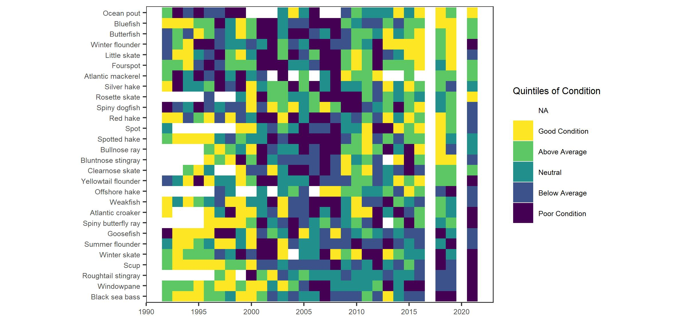
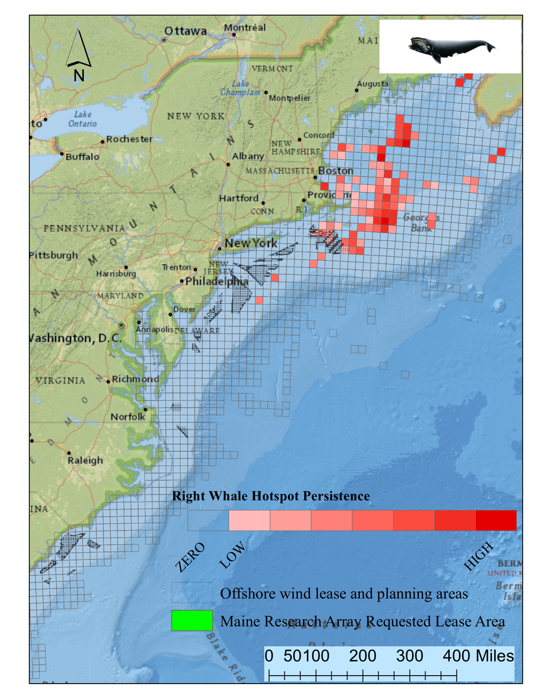

```{r setup, include=FALSE}

# library(tint)
# # invalidate cache when the package version changes
# knitr::opts_chunk$set(tidy = FALSE, cache.extra = packageVersion('tint'))
# options(htmltools.dir.version = FALSE)

#Default Rmd options
knitr::opts_chunk$set(echo = FALSE,
                      message = FALSE,
                      dev = "cairo_pdf",
                      warning = FALSE,
                      fig.width = 4,
                      fig.asp = 0.45,
                      fig.align = 'center'
                      ) #allows for inserting R code into captions

#Plotting and data libraries
#remotes::install_github("noaa-edab/ecodata@0.1.0") #change to 2020 ecodata version for release
library(tidyverse)
library(tidyr)
library(ecodata)
library(here)
library(kableExtra)

```

```{r, code = readLines("https://raw.githubusercontent.com/NOAA-EDAB/ecodata/master/chunk-scripts/human_dimensions_MAB.Rmd-setup.R")}
```

```{r, code = readLines("https://raw.githubusercontent.com/NOAA-EDAB/ecodata/master/chunk-scripts/human_dimensions_MAB.Rmd-GIS-setup.R")}
```

```{r, code = readLines("https://raw.githubusercontent.com/NOAA-EDAB/ecodata/master/chunk-scripts/macrofauna_MAB.Rmd-setup.R")}
```

```{r, code = readLines("https://raw.githubusercontent.com/NOAA-EDAB/ecodata/master/chunk-scripts/LTL_MAB.Rmd-setup.R")}
```

\setcounter{page}{4}
\thispagestyle{fancy}

# Introduction

## About This Report

This report is for the Mid-Atlantic Fishery Management Council (MAFMC). The purpose of this report is to synthesize ecosystem information to allow the MAFMC to better meet fishery management objectives, and to update the MAFMC’s Ecosystem Approach to Fishery Management (EAFM) risk assessment. The major messages of the report are synthesized on pages 1 and 2, and synthesis themes are illustrated on page 3. The information in this report is organized into two sections; [performance measured against ecosystem-level management objectives](#performance-relative-to-fishery-management-objectives) (Table \ref{tab:management-objectives}), and potential [risks to meeting fishery management objectives](#risks-to-meeting-fishery-management-objectives) ([climate change](#climate-and-ecosystem-productivity) and [other ocean uses](#other-ocean-uses-offshore-wind)).

## Report structure

The two main sections contain subsections for each management objective or potential risk. Within each subsection, we first review indicator trends, and the status of the most recent data year relative to a threshold (if available) or relative to the long-term average. Second, we synthesize results of other indicators and information to outline potential implications for management (i.e., connecting indicator(s) status to management and why an indicator(s) is important). For example, if there are multiple drivers related to an indicator trend, which drivers may be more or less supported by current information, and which, if any, can be affected by management action(s)? Similarly, which risk indicators warrant continued monitoring to evaluate whether regime shifts or ecosystem reorganization are likely? We emphasize that these implications are intended to represent testable hypotheses at present, rather than “answers,” because the science behind these indicators and syntheses continues to develop.  

A glossary of terms^[https://noaa-edab.github.io/tech-doc/glossary.html], detailed technical methods documentation^[https://NOAA-EDAB.github.io/tech-doc], and indicator data^[https://github.com/NOAA-EDAB/ecodata] are available online. The details of standard figure formatting (Fig. \ref{fig:docformat}a), categorization of fish and invertebrate species into feeding guilds (Table \ref{tab:species-groupings}), and definitions of ecological production units (EPUs, including the Mid-Atlantic Bight, MAB; Fig. \ref{fig:docformat}b) are provided at the end of the document. 

```{r management-objectives}

mng_obj <- data.frame("Objective Categories" = c("Seafood Production",
                                                 "Profits","Recreation",
                                                 "Stability","Social & Cultural",
                                                 "Protected Species",
                                                 "Biomass","Productivity",
                                                 "Trophic structure","Habitat"),
"Indicators reported" = c("Landings; commercial total and by feeding guild; recreational harvest",
                               "Revenue decomposed to price and volume",
                               "Angler trips; recreational fleet diversity",
                               "Diversity indices (fishery and ecosystem)",
                               "Community engagement/reliance and environmental justice status",
                               "Bycatch; population (adult and juvenile) numbers, mortalities",
                               "Biomass or abundance by feeding guild from surveys",
                               "Condition and recruitment of managed species, primary productivity",
                               "Relative biomass of feeding guilds, zooplankton",
                               "Estuarine and offshore habitat conditions"))

knitr::kable(mng_obj, linesep = "",
      col.names = c("Objective Categories","Indicators reported"),
      caption = "Ecosystem-scale fishery management objectives in the Mid-Atlantic Bight",
      #align = 'c',
      booktabs = T) %>%
  kable_styling(latex_options = "hold_position", "scale_down") %>%
 # column_spec(c(2), width = c("25em")) %>%
  row_spec(0, bold = TRUE) %>%
 # group_rows("Provisioning/Cultural", 1,4) %>%
 # group_rows("Supporting/Regulating", 5,9)
  pack_rows("Provisioning and Cultural Services", 1,6) %>%
  pack_rows("Supporting and Regulating Services", 7,10)


```
 
# Performance Relative to Fishery Management Objectives

In this section, we examine indicators related to broad, ecosystem-level fishery management objectives. We also provide hypotheses on the implications of these trends—*why* we are seeing them, what’s driving them, and potential or observed regime shifts or changes in ecosystem structure. Identifying multiple drivers, regime shifts, and potential changes to ecosystem structure, as well as identifying the most vulnerable resources, can help managers determine whether we can do anything differently to meet objectives and how to prioritize for upcoming issues/risks.

*Special note on data availability for the 2022 report*

The Catch Accounting and Monitoring System (CAMS) that will be used to provide commercial landings and discard information at the Ecological Production Unit (EPU) scale is under development.  As of February 2022, our standard indicators relying on EPU scale landings data cannot be calculated for 2020 (commercial seafood production, commercial profits, ecosystem overfishing). We provide information based on coastwide commercial landings information available at this time in @thunberg_northeast_2021^[https://spo.nmfs.noaa.gov/sites/default/files/TM221.pdf], and will calculate our standard indicators at EPU scales with disaggregated 2020 commercial landings data when they are available. 


## Seafood Production 

### Indicators: Landings; commercial and recreational 
Total commercial landings (black) within the Mid-Atlantic are not yet available for 2020; Figure \ref{fig:total-landings} includes data only through 2019. However, we do not anticipate the long-term declining trend in landings to change.

Coastwide landings at the Federal fishery management plan (FMP) level were mixed in 2020 when compared to recent years [@thunberg_northeast_2021]. Landings of monkfish and of combined surfclam and ocean quahog declined in 2020, while landings of combined summer flounder, scup, and black sea bass increased, and landings of combined squid species increased in 2020. 

```{r, total-landings, fig.cap = paste0("Total commercial seafood landings through 2019 (black) and ",region," managed seafood landings (red)."), code = readLines("https://raw.githubusercontent.com/NOAA-EDAB/ecodata/master/chunk-scripts/human_dimensions_MAB.Rmd-comdat-total-landings.R"), fig.asp=.4}
```

Total recreational harvest (retained fish presumed to be eaten) is down in the MAB (Fig. \ref{fig:rec-landings}). Although harvest has increased from a historic low in 2018, it is still below the average value for the series.
```{r, rec-landings, fig.cap = paste0("Total recreational seafood harvest (millions of pounds) in the ",region," region."), code = readLines("https://raw.githubusercontent.com/NOAA-EDAB/ecodata/master/chunk-scripts/human_dimensions_MAB.Rmd-recdat-landings.R")}

```

Recreational shark landings show an increase in pelagic sharks over the past decade, with a sharp decrease in 2018 - 2019 persisting through 2021 (Fig \ref{fig:rec_hms}). This is likely influenced by regulatory changes implemented in 2018 intended to rebuild shortfin mako stocks. In 2021 the International Commission for the Conservation of Atlantic Tunas (ICCAT) finalized recommendations for a two-year retention ban (ICCAT Rec.21-09), which will also affect total overall landings of pelagic sharks in coming years.
```{r rec_hms, fig.cap="Recreational shark landings from Marine Recreational Information Program.", code = readLines("https://raw.githubusercontent.com/NOAA-EDAB/ecodata/master/chunk-scripts/human_dimensions_MAB.Rmd-rec_hms.R"), fig.width=5, fig.asp=.35}

```

Aquaculture production is not yet included in total seafood landings, but we are working toward including it in future reports. Available aquaculture production of oysters for a subset of Mid-Atlantic states is trending upward.^[https://noaa-edab.github.io/ecodata/human_dimensions_MAB#Commercial; "Oyster Aquaculture" tab]

### Implications

Declining commercial and recreational landings can be driven by many interacting factors, including combinations of ecosystem and stock production, management actions, market conditions (including COVID-19 disruptions), and environmental change. While we cannot evaluate all possible drivers at present, here we evaluate the extent to which stock status and system biomass trends may play a role.  

#### Stock Status and Catch Limits
Single species management objectives (1. maintaining biomass above minimum thresholds and 2. maintaining fishing mortality below overfishing limits) are being met for all but two MAFMC managed species, though the status of six stocks is unknown (Fig. \ref{fig:stock-status}). 
```{r stock-status, fig.cap = paste0("Summary of single species status for ",council_abbr," and jointly federally managed stocks (Spiny dogfish and both Goosefish). Stocks in green are below the biomass threshold (overfished), stocks in orange are above the biomass threshold but below the biomass target, and stocks in purple are above the biomass target. Only one stock, Atlantic mackerel, has fishing mortality above the limit (subject to overfishing)."), code = readLines("https://raw.githubusercontent.com/NOAA-EDAB/ecodata/master/chunk-scripts/human_dimensions_MAB.Rmd-stock-status.R"), fig.width = 7.5, fig.asp = 0.5}
```

Stock status affects catch limits established by the Council, which in turn may affect landings trends. Summed across all MAFMC managed species, total Acceptable Biological Catch or Annual Catch Limits (ABC or ACL) have been relatively stable 2012-2020 (Fig. \ref{fig:abcacl-stacked}). With the addition of blueline tilefish management in 2017, an additional ABC and ACL contribute to the total 2017-2020. Discounting blueline tilefish, the recent total ABC or ACL is lower relative to 2012-2013, with much of that decrease due to declining Atlantic mackerel ABC. 

```{r abcacl-stacked, fig.cap="Sum of catch limits across all MAFMC managed fisheries.", code =  readLines("https://raw.githubusercontent.com/NOAA-EDAB/ecodata/master/chunk-scripts/human_dimensions_MAB.Rmd-abcacl-stacked.R"), fig.width = 5, fig.asp = 0.5}

```

Nevertheless, the percentage caught for each stock’s ABC/ACL suggests that these catch limits are not generally constraining as most species are well below the 1/1 ratio (Fig. \ref{fig:abcacl-catch}). Therefore, stock status and associated management constraints are unlikely to be driving decreased landings for the majority of species.

```{r abcacl-catch, fig.cap = "Catch divided by ABC/ACL for MAFMC managed fisheies. Chub mackerel removed due extremely low catch. Outliers = Recreational Black Sea Bass.", code =  readLines("https://raw.githubusercontent.com/NOAA-EDAB/ecodata/master/chunk-scripts/human_dimensions_MAB.Rmd-abcacl-catch.R")}

```

#### System Biomass
Although aggregate biomass trends derived from scientific resource surveys are mostly stable in the MAB, spring piscivores and fall benthos show long-term increases (Fig. \ref{fig:nefsc-biomass-mab}). While managed species make up varying proportions of aggregate biomass, trends in landings are not mirroring shifts in the overall trophic structure of survey-sampled fish and invertebrates. Therefore, major shifts in feeding guilds or ecosystem trophic structure are unlikely to be driving the decline in landings.
```{r nefsc-biomass-mab, fig.cap = "Spring (left) and fall (right) surveyed biomass in the Mid-Atlantic Bight. Data from the NEFSC Bottom Trawl Survey are shown in black, with the nearshore NEAMAP survey shown in red. The shaded area around each annual mean represents 2 standard deviations from the mean.", code = readLines("https://raw.githubusercontent.com/NOAA-EDAB/ecodata/master/chunk-scripts/macrofauna_MAB.Rmd-aggregate-biomass.R"), fig.width=8, fig.asp = 0.75}
```

#### Effect on Seafood Production
Stock status is mostly acceptable, and aggregate biomass trends appear stable, so the decline in commercial landings is most likely driven by market dynamics affecting the landings of surfclams and ocean quahogs, as landings have been below quotas for these species. 

Climate change also seems to be shifting the distribution of surfclams and ocean quahogs, resulting in areas with overlapping distributions and increased mixed landings. Given the regulations governing mixed landings, this could become problematic in the future and is currently being evaluated by the Council. 

The decline in recreational seafood landings stems from other drivers. Some of the decline, such as that for recreational shark landings, is driven by management intended to reduce fishing mortality on mako sharks. However, NOAA Fisheries’ Marine Recreational Information Program survey methodology was updated in 2018, so it is unclear whether the record-low landings for species other than sharks in 2018 are driven by changes in fishing behavior or the change in the survey methodology. 

Other environmental changes require monitoring as they may become important drivers of landings in the future:
 
- Climate is trending into uncharted territory. Globally, 2021 was the sixth warmest year on record^[https://www.climate.gov/news-features/features/2021-global-climate-summary-6th-warmest-year-record] with regional marine heatwaves apparent (see [Climate Risks section](#climate-and-ecosystem-productivity)).   
- Stocks are shifting distribution, moving towards the northeast and into deeper waters throughout the Northeast US Large Marine Ecosystem (Fig. \ref{fig:species-dist}).  
  
```{r species-dist, fig.cap = "Aggregate species distribution metrics for species in the Northeast Large Marine Ecosystem.", code = readLines("https://raw.githubusercontent.com/NOAA-EDAB/ecodata/master/chunk-scripts/macrofauna_MAB.Rmd-species-dist.R"), fig.asp=.9}
```  

- Some ecosystem composition and production changes have been observed (see [Stability section](#stability)). 
- Some fishing communities are affected by environmental justice vulnerabilities (see [Environmental Justice and Social Vulnerability section](#social-vulnerability)).  

## Commercial Profits 

### Indicators: revenue (a proxy for profits)  
Total commercial revenues (black) within the Mid-Atlantic are not yet available for 2020; Figure \ref{fig:comm-revenue} includes data only through 2019. However, we do not anticipate the long-term declining trend in revenue from managed species (red) to change. Coast-wide, a number of species managed by the MAFMC have seen decreases in revenue when compared to the average revenue generated between 2015 and 2019 [@thunberg_northeast_2021]. This decline was driven by a mix of landings declines (monkfish, combined surfclam and ocean quahog) and price declines (monkfish, combined squid species, and combined summer flounder, scup, and black sea bass). 
```{r comm-revenue, fig.width = 4, fig.asp = 0.45, fig.cap = "Revenue through 2019 for the for the Mid-Atlantic region: total (black) and from MAFMC managed species (red).", code = readLines("https://raw.githubusercontent.com/NOAA-EDAB/ecodata/master/chunk-scripts/human_dimensions_MAB.Rmd-comdat-comm-revenue.R")}
```

### Implications 
The Bennet indicator evaluating changes in landings volume and price for the Mid-Atlantic will be updated when 2020 Mid-Atlantic landings become available.

Changes in other indicators, particularly those driving landings and those related to climate change, require monitoring as they may become important drivers of revenue in the future; for example:

-  Surfclams and ocean quahogs are sensitive to warming ocean temperatures and ocean acidification.   
-  Acidification levels in surfclam summer habitat are approaching, but not yet at, levels affecting surfclam growth (see [Climate Risks section](#climate-and-ecosystem-productivity)).  

## Recreational Opportunities 

### Indicators: Angler trips, fleet diversity  
Recreational effort (angler trips) has increased over the long term, with 2020 effort above the long-term average (Fig. \ref{fig:rec-op}). However, recreational fleet diversity (i.e., effort by shoreside, private boat, and for-hire anglers) has declined over the long term (Fig. \ref{fig:rec-div}). 
```{r rec-op, fig.cap = paste0("Recreational effort in the ",region,"."), code = readLines("https://raw.githubusercontent.com/NOAA-EDAB/ecodata/master/chunk-scripts/human_dimensions_MAB.Rmd-recdat-effort.R")}
```

```{r rec-div, fig.cap = paste0("Recreational fleet effort diversity in the ",region,"."), code = readLines("https://raw.githubusercontent.com/NOAA-EDAB/ecodata/master/chunk-scripts/human_dimensions_MAB.Rmd-recdat-diversity.R")}

```

### Implications
Increased angler trips in 2020 relative to previous years strongly influence the long term increase in recreational effort. While the overall number of recreational opportunities in the MAB is above the long term average, the continuing decline in recreational fleet effort diversity suggests a potentially reduced range of recreational fishing options.

The downward effort diversity trend is driven by party/charter contraction (from a high of 24% of angler trips to 7% currently), and a shift toward shorebased angling. Effort in private boats remained stable between 36-37% of angler trips across the entire series. 

Changes in recreational fleet diversity can be considered when managers seek options to maintain recreational opportunities. Shore anglers will have access to different species than vessel-based anglers, and when the same species is accessible both from shore and from a vessel, shore anglers typically have access to smaller individuals. Many states have developed shore-based regulations where the minimum size is lower than in other areas and sectors to maintain opportunities in the shore angling sector.


## Stability 

### Indicators: fishery fleet and catch diversity, ecological component diversity 
While there are many potential metrics of stability, we use diversity indices as a first check to evaluate overall stability in fisheries and ecosystems. In general, diversity that remains constant over time suggests a similar capacity to respond to change over time. A significant change in diversity over time does not necessarily indicate a problem or an improvement, but does indicate a need for further investigation. We examine commercial fleet and species catch diversity, and recreational species catch diversity (with fleet effort diversity discussed above), and diversity in zooplankton, and larval and adult fishes.

#### Fishery Diversity 
Diversity estimates have been developed for fleets landing managed species, and species landed by commercial vessels with Mid-Atlantic permits. A fleet is defined here as the combination of gear type (Scallop Dredge, Other Dredge, Gillnet, Hand Gear, Longline, Bottom Trawl, Midwater Trawl, Pot, Purse Seine, or Clam Dredge) and vessel length category (less than 30 ft, 30 to 50 ft, 50 to 75 ft, 75 ft and above). Commercial fishery fleet count and fleet diversity have been stable over time in the MAB, with current values near the long-term average (Fig. \ref{fig:commercial-div}). This indicates similar commercial fleet composition and species targeting opportunities over time. 
```{r commercial-div, fig.cap = paste0("Commercial fleet count and diversity in the ",region,"."), code = readLines("https://raw.githubusercontent.com/NOAA-EDAB/ecodata/master/chunk-scripts/human_dimensions_MAB.Rmd-commercial-div.R"), fig.asp=.9}
```

Commercial fisheries are relying on fewer species relative to the mid-90s, but current species revenue diversity has been consistent since then and is currently near, but below, the long term average (Fig. \ref{fig:commercial-div-species-div}). 
```{r commercial-div-species-div,  fig.cap = paste0("Species revenue diversity in the ",region,"."), code = readLines("https://raw.githubusercontent.com/NOAA-EDAB/ecodata/master/chunk-scripts/human_dimensions_MAB.Rmd-commercial-div-species-div.R")}
```

As noted [above](#recreational-opportunities), recreational fleet effort diversity is declining (Fig. \ref{fig:rec-div}), so this metric suggests an unstable range of recreational fishing opportunties. However, recreational species catch diversity has no long term trend so is considered stable, and has been at or above the long term average in 7 of the last 10 years (Fig. \ref{fig:recdat-div-catch}). 
```{r recdat-div-catch, fig.cap = paste0("Diversity of recreational catch in the ",region,"."), code = readLines("https://raw.githubusercontent.com/NOAA-EDAB/ecodata/master/chunk-scripts/human_dimensions_MAB.Rmd-recdat-div-catch.R")}
```

#### Ecological Diversity

Ecological diversity indices show mixed trends. Up to 2019, zooplankton diversity was increasing in the MAB (Fig. \ref{fig:zoo-diversity}). 2020 surveys were incomplete due to COVID-19. Zooplankton and larval fish diversity indicators will be updated once 2021 survey results have been processed. Adult fish diversity is measured as the expected number of species in a standard number of individuals sampled from the NEFSC bottom trawl survey. There is no vessel correction for this metric, so indices collected aboard the research vessel Albatross IV (up to 2008) and research vessel Bigelow (2009-2021) are calculated separately. Despite this, adult fish diversity indices appear stable over time, with current values within one standard deviation from most historic estimates (Fig. \ref{fig:exp-n}). 
```{r zoo-diversity, fig.cap = "Zooplankton diversity in the Mid-Atlantic Bight up to 2019, based on Shannon diversity index.", code = readLines("https://raw.githubusercontent.com/NOAA-EDAB/ecodata/master/chunk-scripts/LTL_MAB.Rmd-zoo-diversity.R")}
```


```{r exp-n, fig.cap = "Adult fish diversity in the Mid-Atlantic Bight, based on expected number of species. Results from survey vessels Albatross and Bigelow are reported separately due to catchability differences.", code = readLines("https://raw.githubusercontent.com/NOAA-EDAB/ecodata/master/chunk-scripts/macrofauna_MAB.Rmd-exp-n.R"), fig.width=5, fig.asp=.4}
```

 
### Implications
Fleet diversity indices are used by the MAFMC to evaluate stability objectives as well as risks to fishery resilience and maintaining equity in access to fishery resources [@gaichas_implementing_2018]. 

Stability in commercial fleet diversity metrics suggests stable capacity to respond to the current range of fishing opportunities. 

Declining recreational fleet effort diversity, as noted [above](#recreational-opportunities), indicates that the party/charter boat sector continues to contract, with shoreside angling becoming more important, as a percentage of recreational angler trips.

Stability in recreational species catch diversity has been maintained by a different set of species over time. A recent increase in Atlantic States Marine Fisheries Commission (ASMFC) and South Atlantic Fishery Management Council (SAFMC) managed species in recreational catch is helping to maintain diversity in the same range that MAFMC and New England Fishery Management Council (NEFMC) species supported in the 1990s.

Ecological diversity indices can provide insight into ecosystem structure. Changes in ecological diversity over time may indicate altered ecosystem structure with implications for fishery productivity and management [@friedland_changes_2020].

Increasing zooplankton diversity through 2019 is driven by the declining dominance of the calanoid copepod *Centropages typicus*, with a similar composition of other zooplankton species. 

Stable adult fish diversity indicates the same overall number and evenness over time, but doesn’t rule out species substitutions (e.g., warm-water replacing cold-water). In addition, the change in survey vessels complicates interpretation of long term fish diversity trends.

In the MAB, existing diversity indicators suggest overall stability in the fisheries and ecosystem components examined. However, declining recreational fleet diversity suggests a potential loss in the range of recreational fishing opportunities, and increasing zooplankton diversity is due to the declining dominance of an important species, suggesting change in the zooplankton community that warrants continued monitoring to determine if managed species are affected. 

## Environmental Justice and Social Vulnerability 

### Indicators: Environmental Justice and Social Vulnerability in commercial and recreational fishing communities

Social vulnerability measures social factors that shape a community’s ability to adapt to change. A subset of these can be used to assess potential environmental justice issues. Environmental Justice is defined in Executive Order 12898 as federal actions intended to address disproportionately high and adverse human health and environmental effects of federal actions on minority and low-income populations. Three of the existing NOAA Fisheries Community Social Vulnerability Indicators (CSVIs), the Poverty Index, Population Composition Index, and Personal Disruption Index, can be used for mandated Environmental Justice analysis^[https://www.fisheries.noaa.gov/national/socioeconomics/social-indicators-coastal-communities]. 

Commercial fishery engagement measures the number of permits and dealers, and pounds and value landed in a community, while reliance expresses these numbers based on the level of fishing activity relative to the total population of a community. Recreational fishery engagement measures shore, private vessel, and for-hire fishing effort while reliance expresses these numbers based on fishing effort relative to the population of a community.

In 2021, we reported the top ten most engaged, and top ten most reliant commercial and recreational fishing communities and their associated social vulnerability. Here we apply the same selection standard for top ten fishing communities for both sectors, and focus on examining the environmental justice vulnerability in these communities.

Communities plotted in the upper right section of Fig.\ref{fig:commercial-engagement} scored high for both commercial engagement and reliance, including Cape May and Barnegat Light, NJ, and Reedville, VA. Communities that ranked medium-high or above for one or more of the environmental justice indicators are highlighted in bright orange: Newport News, VA; Atlantic City, NJ; Hampton Bays/Shinnecock, NY; and Beaufort, Columbia and Hobucken, NC.

```{r commercial-engagement, fig.cap= "Commercial engagement, reliance, and environmental justice vulnerability for the top commercially engaged and reliant fishing communities in the Mid-Atlantic.  Communities ranked medium-high or above for one or more of the environmental justice indicators are highlighted in bright orange. *Community scored high (1.00 and above) for both commercial engagement and reliance indicators.", code = readLines("https://raw.githubusercontent.com/NOAA-EDAB/ecodata/master/chunk-scripts/human_dimensions_MAB.Rmd-commercial-engagement.R"), fig.width = 6.5, fig.asp = 0.75}

#(* Scored high (1.00 and above)) for both commercial engagement and reliance indicators)
```

Fig. \ref{fig:commercial-EJ} shows the detailed scores of the three environmental justice indicators for the same communities plotted in Fig.\ref{fig:commercial-engagement}. Communities are plotted clockwise in a descending order of commercial engagement scores from high to low, with the most highly engaged community, Cape May, NJ, listed on the top. Among the communities ranked medium-high or above for environmental justice vulnerability, Newport News, VA scored medium-high for the population composition index. Atlantic City, NJ scored high for all of the three environmental justice indicators. Hampton Bays/Shinnecock, NY scored medium-high for the population composition index. Beaufort, NC scored medium-high and very close to high for the poverty index. Columbia, NC scored high for the personal disruption index and the poverty index, and medium-high for the population composition index. Hobucken, NC scored high for the personal disruption index and the poverty index.

```{r commercial-EJ, fig.cap="Environmental justice indicators (Poverty Index, population composition index, and personal disruption index) for top commercial fishing communities in Mid-Atlantic. *Community scored high (1.00 and above) for both commercial engagement and reliance indicators.", out.width='80%'}

#knitr::include_graphics("images/EJ_Commercial_MAB.png")

#get rid of the gray excel outline using R package magick
ComEJ <- magick::image_read("images/EJ_Commercial_MAB.png") 

# from https://stackoverflow.com/questions/64597525/r-magick-square-crop-and-circular-mask
# get height, width and crop longer side to match shorter side
ii <- magick::image_info(ComEJ)

cropComEJ <- ComEJ %>%
  #magick::image_crop(cropComEJ, "820x580+5+5")
  magick::image_crop(paste0(ii$width-10,"x",ii$height-10, "+5+5"))

cropComEJ
```

Communities plotted in the upper right section of Fig.\ref{fig:recreational-engagement} scored high for both recreational engagement and reliance, including Barnegat Light, NJ and Deal Island, MD. Communities that ranked medium-high or above for one or more of the environmental justice indicators are highlighted in bright orange: Hatteras and Morehead City, NC.

```{r recreational-engagement, fig.cap= "Recreational engagement and reliance, and environmental justice vulnerability, for the top recreationally engaged and reliant fishing communities in the Mid-Atlantic. Communities ranked medium-high or above for one or more of the environmental justice indicators are highlighted in bright orange. *Community scored high (1.00 and above) for both commercial engagement and reliance indicators.", code = readLines("https://raw.githubusercontent.com/NOAA-EDAB/ecodata/master/chunk-scripts/human_dimensions_MAB.Rmd-recreational-engagement.R"), fig.width = 6.5, fig.asp = 0.75}

#(* Scored high (1.00 and above) for both recreational engagement and reliance indicators; 
```

Fig. \ref{fig:recreational-EJ} orders communities clockwise in a descending order of recreational engagement scores from high to low, with the most highly engaged community, Babylon, NY, listed on the top. The two communities with environmental justice concerns, Hatteras and Morehead City, NC, both scored medium-high for the poverty index. 

```{r recreational-EJ, fig.cap="Environmental justice indicators (Poverty Index, population composition index, and personal disruption index) for top recreational fishing communities in Mid-Atlantic. *Community scored high (1.00 and above) for both commercial engagement and reliance indicators.", out.width='80%'}
#knitr::include_graphics("images/EJ_Recreational_MAB.png")


#get rid of the gray excel outline using R package magick
RecEJ <- magick::image_read("images/EJ_Recreational_MAB.png") 

# from https://stackoverflow.com/questions/64597525/r-magick-square-crop-and-circular-mask
# get height, width and crop longer side to match shorter side
ii <- magick::image_info(RecEJ)

cropRecEJ <- RecEJ %>%
  #magick::image_crop(cropComEJ, "820x580+5+5")
  magick::image_crop(paste0(ii$width-10,"x",ii$height-10, "+5+5"))

cropRecEJ
```


Both commercial and recreational fishing are important activities in Montauk, NY, Barnegat Light, Cape May and Point Pleasant Beach, NJ, meaning these communities may be impacted simultaneously by commercial and recreational regulatory changes. All of these communities scored lower than medium-high for all of the three environmental justice indicators, indicating that environmental justice may not be a major concern in these communities at the moment based on the indicators analyzed.

### Implications
These plots provide a snapshot of the presence of environmental justice issues in the most highly engaged and most highly reliant commercial and recreational fishing communities in the Mid-Atlantic. These communities may be vulnerable to changes in fishing patterns due to regulations and/or climate change. When any of these communities are also experiencing social vulnerability including environmental justice issues, they may have lower ability to successfully respond to change. 


## Protected Species
Protected species include marine mammals protected under the Marine Mammal Protection Act, endangered and threatened species protected under the Endangered Species Act, and migratory birds protected under the Migratory Bird Treaty Act. In the Northeast U.S., endangered/threatened species include Atlantic salmon, Atlantic and shortnose sturgeon, all sea turtle species, and five baleen whales. Fishery management objectives for protected species generally focus on reducing threats and on habitat conservation/restoration. Here we report on the status of these actions as well as indicating the potential for future interactions driven by observed and predicted ecosystem changes in the Northeast U.S.
Protected species objectives include managing bycatch to remain below potential biological removal (PBR) thresholds, recovering endangered populations, and monitoring unusual mortality events (UMEs).

### Indicators: bycatch, population (adult and juvenile) numbers, mortalities
As of 2019, rolling 5 year average bycatch indices for both harbor porpoise and gray seal bycatch were below current PBR thresholds, thus meeting management objectives. However, the 2019 bycatch estimate for gray seals was the highest in the time series and above PBR for that year (see 2021 report^[https://repository.library.noaa.gov/view/noaa/29525]). Bycatch indices were not updated because of low 2020 observer coverage caused by COVID-19 restrictions.

The North Atlantic right whale population was on a recovery trajectory until 2010, but has since declined (Fig. \ref{fig:narw-abundance}). Reduced survival rates of adult females and diverging abundance trends between sexes have also been observed. It is estimated that there are fewer than 100 adult females remaining in the population. 
```{r narw-abundance, fig.cap = "Estimated North Atlanic right whale abundance on the Northeast Shelf.", code = readLines("https://raw.githubusercontent.com/NOAA-EDAB/ecodata/master/chunk-scripts/macrofauna_MAB.Rmd-narw-abundance.R")}
```
North Atlantic right whale calf counts have generally declined after 2009 to the point of having zero new calves observed in 2018 (Fig. \ref{fig:NARW-calf-abundance}). However, seven new calves were born in 2019, 10 were born in 2020, and preliminary 2021 observations of 18 calves have been recorded as of January 2022.  
```{r NARW-calf-abundance, fig.cap = "Number of North Atlantic right whale calf births, 1990 - 2021.", code = readLines("https://raw.githubusercontent.com/NOAA-EDAB/ecodata/master/chunk-scripts/macrofauna_MAB.Rmd-NARW-calf-abundance.R")}
```

This year, the Unusual Mortality Event (UME) for North Atlantic right whales continued. Since 2017, the total UME right whale mortalities includes 34 dead stranded whales, 13 in the US and 21 in Canada. When alive but seriously injured whales (16) are taken into account, 50 individual whales are included in the UME. During 2020, two mortalities were documented, however, recent research suggests that many mortalities go unobserved and the true number of mortalities are about three times the count of the observed mortalities [@pace_cryptic_2021]. The primary cause of death is “human interaction” from entanglements or vessel strikes^[https://www.fisheries.noaa.gov/national/marine-life-distress/2017-2022-north-atlantic-right-whale-unusual-mortality-event]. 

Two additional UMEs continued from previous years for humpback whales and minke whales; suspected causes include human interactions and/or infectious disease. A UME for both gray and harbor seals was declared from 2018-2020 due to a high number of mortalities thought to be caused by phocine distemper virus, but is pending closure as of January 2022^[https://www.fisheries.noaa.gov/national/marine-life-distress/active-and-closed-unusual-mortality-events].


### Implications
Bycatch management measures have been implemented to maintain bycatch below PBR thresholds. The downward trend in harbor porpoise bycatch could also be due to a decrease in harbor porpoise abundance in US waters, reducing their overlap with fisheries, and a decrease in gillnet effort. The increasing trend in gray seal bycatch may be related to an increase in the gray seal population (U.S. pup counts).

The number of gray seals in U.S. waters has risen dramatically in the last three decades. Based on a survey conducted in 2016, the size of the gray seal population in the U.S. during the breeding season was approximately 27,000 animals, while in Canada the population was estimated to be roughly 425,000. The population in Canada is increasing at roughly 4% per year, and contributing to rates of increase in the U.S., where the number of pupping sites has increased from one in 1988 to nine in 2019. Mean rates of increase in the number of pups born at various times since 1988 at four of the more data-rich pupping sites (Muskeget, Monomoy, Seal, and Green Islands) ranged from no change on Green Island to high rates of increase on the other three islands, with a maximum increase of 26.3% (95\%CI: 21.6 - 31.4\%; @wood_rates_2020, and see the 2021 New England report^[https://repository.library.noaa.gov/view/noaa/29524]). These high rates of increase provide further support for the hypothesis that seals from Canada are continually supplementing the breeding population in U.S. waters.  

Strong evidence exists to suggest that interactions between right whales and both the fixed gear fisheries in the U.S. and Canada and vessel strikes in the U.S. are contributing substantially to the decline of the species [@hayes_north_2018]. Further, right whale distribution has changed since 2010. New research suggests that recent climate driven changes in ocean circulation have resulted in right whale distribution changes driven by increased warm water influx through the Northeast Channel, which has reduced the primary right whale prey (*Calanus finmarchicus*) in the central and eastern portions of the Gulf of Maine [@hayes_north_2018; @record_rapid_2019; @sorochan_north_2019].

The UMEs are under investigation and are likely the result of multiple drivers. For all three large whale UMEs, human interaction appears to have contributed to increased mortalities, although investigations are not complete. An investigation into the cause of the seal UME so far suggests phocine distemper virus as a potential cause. 

A marine mammal climate vulnerability assessment is currently underway for Atlantic and Gulf of Mexico populations and will be reported on in future versions of this report.


# Risks to meeting fishery management objectives

## Climate and Ecosystem Productivity

Large scale climate related changes in the ecosystem can lead to changes in important habitats and ecological interactions, potentially resulting in regime shifts and ecosystem reorganization.  

### Climate Change Indicators: ocean temperature, heatwaves, currents, acidification

#### Ocean and estuarine temperature and salinity
Ocean temperatures continue to warm at both the surface (Fig. \ref{fig:seasonal-sst-anom-gridded}) and bottom (Fig. \ref{fig:bottom-temp}) throughout the Northeast Shelf including the Mid-Atlantic. Seasonal sea surface temperatures in 2021 were above average throughout the year, with some seasons rivaling or exceeding the record warm temperatures observed in 2012.

```{r seasonal-sst-anom-gridded, fig.cap="MAB (grey outline) seasonal sea surface temperature (SST) time series overlaid onto 2021 seasonal spatial anomalies. Seasons are defined as: Jan-Mar for winter, Apr-Jun for spring, Jul-Sep for summer, and Oct-Dec for fall.", code=readLines("https://raw.githubusercontent.com/NOAA-EDAB/ecodata/master/chunk-scripts/LTL_MAB.Rmd-seasonal-sst-anom-gridded.R"), fig.width = 8, fig.asp = .6}

```

```{r bottom-temp, fig.cap="Annual bottom temperature in the MAB (black = in situ observations, red = observations from modeled reanalysis for comparison).", code=readLines("https://raw.githubusercontent.com/NOAA-EDAB/ecodata/master/chunk-scripts/LTL_MAB.Rmd-bottom-temp.R")}
```

The Chesapeake Bay experienced a warmer-than-average winter and fall in 2021, and average conditions in the spring and summer, relative to the baseline period 2008-2020 (Fig. \ref{fig:ches-temp-sal}) as measured by satellites^[https://coastwatch.noaa.gov/cw/index.html] (note that Chesapeake Bay seasonal definitions and baseline periods are different from the sea surface temperature anomalies reported in Fig.\ref{fig:seasonal-sst-anom-gridded} for the full Mid-Atlantic region). Similar 2021 seasonal temperature patterns were observed by bouys^[https://buoybay.noaa.gov/] (Fig. \ref{fig:ches-temp-sal}), which also indicated above-average salinity in the Chesapeake Bay throughout the summer, with a decrease in salinity from late July to early August (Fig. \ref{fig:ches-temp-sal}). Salinity fell below average in September and remained at lower levels throughout fall 2021.

```{r ches-temp-sal, fig.cap="Left panel: 2021 sea surface temperature anomalies for the Chesapeake Bay.  Data are from NOAA’s multi-satellite SST products and produced by NOAA’s Coastwatch Program. Seasons are defined to match the annual life cycles of many biological resources in Chesapeake Bay: Dec-Feb for winter, Mar-May for spring, Jun-Aug for summer, and Sep-Nov for fall. Right panel: NOAA Chesapeake Bay Interpretive Buoy System Gooses Reef bouy sea water temperature (top) and salinity (bottom); Red = 2021, Blue = Long term average 2010-2020.", fig.width = 10, fig.asp=0.6 }

library(patchwork)
# Left panel
sst<- ecodata::ches_bay_sst

map.lwd <- 0.4

# Set lat/lon window for maps
xmin = -77.5
xmax = -74.5
ymin = 36.5
ymax = 40
xlims <- c(xmin, xmax)
ylims <- c(ymin, ymax)
#sst <- ecodata::seasonal_sst_anomaly_gridded
crs<- "+proj=longlat +lat_1=35 +lat_2=45 +lat_0=40 +lon_0=-77 +x_0=0 +y_0=0 +datum=NAD83 +no_defs +ellps=GRS80 +towgs84=0,0,0"
sst$Season <- factor(sst$Season, levels = c("Winter",
                                            "Spring",
                                            "Summer",
                                            "Fall"))

sst<- sst %>% dplyr::mutate(Value = replace(Value, Value > 5, 5))
sst_map <-
  ggplot2::ggplot() +
  ggplot2::geom_sf(data = ecodata::coast, size = map.lwd) +
  ggplot2::scale_fill_gradient2(name = "Temp.\nAnomaly (C)",
                                low = scales::muted("blue"),
                                mid = "white",
                                high = scales::muted("red"),
                                limits = c(-4,4),
                                labels = c("<-5", "-2.5", "0", "2.5", ">5")) +
  ggplot2::coord_sf(crs = crs, xlim = xlims, ylim = ylims) +

  ggplot2::geom_tile(data = sst, aes(x = Latitude, y = Longitude,fill = Value)) +
  ggplot2::facet_wrap(Season~.) +
  ecodata::theme_map() +
  ggplot2::ggtitle("Chesapeake Bay SST anomaly (2021)") +
  ggplot2::xlab(element_blank()) +
  ggplot2::ylab(element_blank()) +
  scale_y_continuous(breaks = seq(37, 40, by = 1))+
  scale_x_continuous(breaks = seq(-77, -75, by = 1))+
  ggplot2::theme(panel.border = element_rect(colour = "black", fill=NA, size=0.75),
                 legend.key = element_blank(),
                 axis.title = element_text(size = 6),
                 strip.background = element_blank(),
                 strip.text=element_text(hjust=0),
                 axis.text = element_text(size = 6),
                 axis.title.y = element_text(angle = 90) )+
  ecodata::theme_title()


#sst_map

# Right panel top
tempbouy <- ecodata::ch_bay_temp %>%
  tidyr::pivot_wider(names_from = Var, values_from = Value) %>% 
  dplyr::mutate(YearLTAC = (YearLTA - 32)*(5/9),
                minLTAC = (minLTA - 32)*(5/9),
                maxLTAC = (maxLTA - 32)*(5/9), 
                YearC = (Year - 32)*(5/9)) %>% 
  ggplot2::ggplot() +
  ggplot2::geom_ribbon(aes(x = Time, ymin = minLTAC, ymax = maxLTAC), fill = "grey", alpha = 0.5)+
  
  ggplot2::geom_line(aes(x = Time, y = YearLTAC, color= "Long Term Average 2010-2020")) +
  ggplot2::geom_line(aes(x = Time, y = YearC, color = "Daily 2021")) +
  ggplot2::ylab("Temperature (C)") +
  ggplot2::ggtitle("Chesapeake Bay Temperature") +
  ggplot2::theme(legend.position = "bottom", 
                 legend.title = element_blank())+
  ecodata::theme_ts()+
  ecodata::theme_title()

# Right panel bottom
salbouy <- ecodata::ch_bay_sal %>%
  tidyr::pivot_wider(names_from = Var, values_from = Value) %>% 
  ggplot2::ggplot() +
  ggplot2::geom_ribbon(aes(x = Time, ymin = minLTA, ymax = maxLTA), fill = "grey", alpha = 0.5)+
  
  ggplot2::geom_line(aes(x = Time, y = YearLTA, color= "Long Term Average 2010-2020")) +
  ggplot2::geom_line(aes(x = Time, y = Year, color = "Daily 2021")) +
  ggplot2::ylab("Salinity") +
  ggplot2::ggtitle("Chesapeake Bay Salinity") +
  ggplot2::theme(legend.position = "bottom", 
                 legend.title = element_blank())+
  ecodata::theme_ts()+
  ecodata::theme_title()

design <- "12
           13"

sst_map + tempbouy + salbouy + plot_layout(design = design) 

```

#### Marine heatwaves
A marine heatwave is a warming event that lasts for five or more days with sea surface temperatures warmer than 90% of previously observed (1982-2011) temperatures for that date [@hobday_hierarchical_2016]. Marine heatwaves measure not just high temperature, but how long the ecosystem is subjected to the high temperature. They are driven by both atmospheric and oceanographic factors and can have dramatic impacts on marine ecosystems. The region is experiencing more frequent marine heatwaves over the last decade, including 2021, compared to the historical period.

In 2021, the Mid-Atlantic Bight experienced seven distinct marine heatwaves with the strongest event beginning on September 13 and lasting 53 days (Fig. \ref{fig:heatwave-year}). Relative to prior years, this marine heatwave ranked 9^th^ on record in terms of maximum intensity and 4^th^ on record in terms of cumulative intensity. 

```{r heatwave-year, fig.cap="Marine heatwave events (red shading above black line) in the Mid-Atlantic occuring in 2021.", code=readLines("https://raw.githubusercontent.com/NOAA-EDAB/ecodata/master/chunk-scripts/LTL_MAB.Rmd-heatwave-year.R"), fig.width=5, fig.asp=.6}

```

#### Ocean currents and features

Variability of the Gulf Stream is one of the major drivers of changes in the oceanographic conditions of the Slope Sea and subsequently the Northeast U.S. continental shelf [@gangopadhyay_census_2020]. Changes in the Gulf Stream and Slope Sea can affect large-scale climate phenomena as well as local ecosystems and coastal communities. During the last decade, the Gulf Stream has become less stable and shifted northward [@andres_recent_2016; @caesar_observed_2018] (Fig. \ref{fig:GSI}).  A more northern Gulf Stream position is associated with warmer ocean temperature on the northeast shelf [@zhang_role_2007], a higher proportion of Warm Slope Water in the Northeast Channel, and increased sea surface height along the U.S. east coast [@goddard_extreme_2015]. 

```{r GSI, fig.cap = "Index representing changes in the location of the Gulf Stream north wall. Positive values represent a more northerly Gulf Stream position.", code=readLines("https://raw.githubusercontent.com/NOAA-EDAB/ecodata/master/chunk-scripts/LTL_MAB.Rmd-gsi.R")}
```

Since 2008, the Gulf Stream has moved closer to the Grand Banks, reducing the supply of cold, fresh, and oxygen-rich Labrador Current waters to the Northwest Atlantic Shelf [@goncalves_neto_changes_2021]. Nearly every year since 2010, warm slope water made up more than 75% of the annual slope water proportions entering the Gulf of Maine.  In 2017 and 2019, almost no cooler Labrador Slope water entered the Gulf of Maine through the Northeast Channel (Fig. \ref{fig:wsw-prop}).  The changing proportions of source water affect the temperature, salinity, and nutrient inputs to the Gulf of Maine ecosystem.  In 2021, warm slope water continued to dominate (86.1%) inputs to the Gulf of Maine. The 2022 position of the north wall of the Gulf Stream is forecasted to be similar to 2021 [@silver_forecasting_2021], extending this pattern.

```{r wsw-prop, fig.cap = "Proportion of Warm Slope Water (WSW) and Labrador Slope Water (LSLW) entering the Gulf of Maine through the Northeast Channel.", code=readLines("https://raw.githubusercontent.com/NOAA-EDAB/ecodata/master/chunk-scripts/LTL_NE.Rmd-slopewater.R"), fig.width=5, fig.asp=.35}
```

The increased instability of the Gulf Stream position and warming of the Slope Sea may also be connected to the regime shift increase in the number of warm core rings formed annually in the Northwest Atlantic [@gangopadhyay_observed_2019; @gangopadhyay_census_2020] (Fig. \ref{fig:wcr}). Timing of ring formation may also be changing. In 2021, a remarkable number of rings were observed simultaneously near the shelf break in June. When warm core ring water moves onto the continental shelf, it can alter the habitat and disrupt seasonal movements of fish [@gawarkiewicz_changing_2018].

```{r wcr, fig.show = 'hold', out.width = "49%", fig.cap= "Warm core ring formation on the Northeast U.S. Shelf: Annual number of rings (left) and June 2021 rings (right), where the black line is the 200 m isobath (the shelf break) and the red lines are the 20 and 24 degree isotherms.", fig.width=8}
#code=readLines("https://raw.githubusercontent.com/NOAA-EDAB/ecodata/master/chunk-scripts/LTL_MAB.Rmd-wcr.R")

#left
upper.line<-ecodata::wcr %>%
  dplyr::filter(Time>2000) %>% 
  dplyr::mutate(hline = c(mean(Value)))
lower.line<-ecodata::wcr%>%
  dplyr::filter(Time<2000) %>% 
  dplyr::mutate(hline = c(mean(Value)))
wcr<- upper.line %>% 
  rbind(lower.line)

wcr %>% 
  ggplot2::ggplot(aes(x = Time, y = Value))+
    ggplot2::annotate("rect", fill = shade.fill, alpha = shade.alpha,
      xmin = x.shade.min , xmax = x.shade.max,
      ymin = -Inf, ymax = Inf) +
  ggplot2::geom_point()+
  ggplot2::geom_line()+
  ggplot2::ylab("Warm Core Ring Births")+
  ggplot2::xlab(element_blank())+
  ggplot2::ggtitle("Warm Core Rings")+
  ecodata::theme_ts()+
  ggplot2::geom_segment(data = upper.line, aes(x = min(Time), y = hline, 
                                      xend = max(Time), yend = hline, color = "segment") )+
  ggplot2::geom_segment(data = lower.line, aes(x = min(Time), y = hline, 
                                    xend = max(Time), yend = hline, color = "segment") )+
  ggplot2::theme(legend.position = "none")+
  ecodata::theme_title()

# right
knitr::include_graphics("images/D_20210608-MUR-SST-WCR.PNG")

```

When warm core rings and eddies interact with the continental slope they can transport warm, salty water to the continental shelf [@chen_mesoscale_2022], and this is now happening more frequently [@gawarkiewicz_changing_2018; @gawarkiewicz_increasing_nodate]. These interactions can be significant contributors to marine heatwaves in the Mid-Atlantic Bight [@gawarkiewicz_characteristics_2019; @chen_mesoscale_2022] as well as the movement of shelf-break species inshore [@gawarkiewicz_changing_2018; @potter_horizontal_2011; @worm_predator_2003]. 

Changes in ocean temperature and circulation alter habitat features such as the seasonal cold pool, a 20–60 m thick band of cold, relatively uniform near-bottom water that persists from spring to fall over the mid and outer shelf of the MAB and southern flank of Georges Bank [@lentz_seasonal_2017; @chen_seasonal_2018]. The cold pool plays an essential role in the structuring of the MAB ecosystem. It is a reservoir of nutrients that feeds phytoplankton productivity, is essential fish spawning and nursery habitat, and affects fish distribution and behavior [@lentz_seasonal_2017; @miles_offshore_2021]. The average temperature of the cold pool is getting warmer over time [@miller_state-space_2016; @du_pontavice_incorporating_nodate], the area is getting smaller [@friedland_middle_2022], and the duration is getting shorter (Fig. \ref{fig:cold-pool}).

```{r cold-pool, fig.cap="Seasonal cold pool indices: mean temperature within the cold pool, cold pool persistence, and spatial extent.",  code=readLines("https://raw.githubusercontent.com/NOAA-EDAB/ecodata/master/chunk-scripts/LTL_MAB.Rmd-cold_pool.R"), fig.width=10, fig.asp=.35}

```


#### Ocean Acidification
Ocean acidification (OA) has caused measured declines in global ocean pH. On the Northeast Shelf, summer bottom pH (2007-2021) varied spatially and temporally, ranging from 7.69-8.07 (Fig. \ref{fig:mab-oa}, left panel). The lowest pH values were recorded in western Long Island Sound, and nearshore to mid-shelf waters off the coast of New Jersey. In summer 2021, water column pH from the glider-based profiles ranged from 7.67-8.22 (Fig. \ref{fig:mab-oa}, right panel). The lowest pH occurred in bottom waters, reaching minimum values in shallow waters typically inhabited by Atlantic surfclams (27-56 m) in the southern flank of the Hudson Canyon (mean pH = 7.80). 

This seasonal pH minimum in the Mid-Atlantic is associated with cold pool subsurface and bottom water, which is cut off from mixing with surface water by strong stratification. Fall mixing and slope water intrusions act to increase the pH in outer shelf waters [@wrightfairbanks_autonomous_2020]. 

```{r mab-oa, out.width = '80%', fig.cap = "Left: Summer bottom pH collated from all quality-controlled vessel- and glider-based measurements from 2007-2021. Right: Glider-based pH profiles collected during summer 2021 in the Mid-Atlantic."}

knitr::include_graphics("images/Saba_Fig_SOE_MAFMC - Grace Saba.png")

```

### Ecosystem Productivity Indicators: phytoplankton, zooplankton, forage fish, fish condition

#### Phytoplankton
Phytoplankton support the food web as the primary food source for zooplankton and filter feeders such as shellfish. Numerous environmental and oceanographic factors interact to drive the abundance, composition, spatial distribution, and productivity of phytoplankton. In 2021, MAB phytoplankton biomass (surface chlorophyll) was above average in winter, but below average during the spring and summer months. Below average phytoplankton biomass could be due to reduced nutrient flow to the surface and/or increased grazing pressure. A short fall bloom was detected in November. Primary productivity (the rate of photosynthesis) was average to below average throughout 2021 (Fig. \ref{fig:chl-weekly}).

```{r chl-weekly, fig.cap = "Weekly chlorophyll concentrations and primary productivity in the Mid-Atlantic are shown by the colored line for 2021 (dashed portion indicates preliminary data from a near real-time satellite source). The long-term mean is shown in black and shading indicates +/- 1 standard deviation.", code=readLines("https://raw.githubusercontent.com/NOAA-EDAB/ecodata/master/chunk-scripts/LTL_MAB.Rmd-chl-weekly.R"), fig.width = 5, fig.asp = 0.9}
```

The seasonal cycle of phytoplankton size distribution shows that the spring and fall bloom periods are dominated by larger-celled microplankton, while smaller-celled nanoplankton dominate during the warmer summer months. The proportion of the smallest phytoplankton, picoplankton (0.2-2 microns), is relatively constant throughout the year. In 2021, microplankton proportions were above average during the winter and fall bloom periods, but below average for the summer months (Fig. \ref{fig:weekly-phyto-size}). 
```{r weekly-phyto-size, fig.cap="The annual climatology (1998-2020) percent composition of the phytoplankton size classes in the Mid-Atlantic based on satellite observations in the shaded portions.  The 2021 proportions for the microplankton (>20 microns, green) and nanoplankton (2-20 microns, orange) are shown in the bold lines.", code=readLines("https://raw.githubusercontent.com/NOAA-EDAB/ecodata/master/chunk-scripts/LTL_MAB.Rmd-weekly-phyto-size.R"), fig.asp=.6}
```

#### Zooplankton  
While zooplankton indicators could not be updated for this report due to 2020 survey disruptions and lags in sample processing, data up to 2019 showed long-term increasing trends of gelatinous zooplankton and krill on the northeast shelf (see 2021 report^[https://repository.library.noaa.gov/view/noaa/29525]). Preliminary 2021 observations found the total volume of plankton caught in the bongo net was significantly greater than the previous years due to increased gelatinous zooplankton, predominantly salps (*Thalia democratica*). Unusually high concentrations of salps were found throughout the Northeast shelf and in the Slope Sea during other summer 2021 scientific surveys, which may be associated with water mass intrusions at the shelf break [@madin_periodic_2006; @deibel_predictability_2009]. Salps are filter feeders feeding on phytoplankton and other small particles and may have contributed to the below average phytoplankton biomass in summer 2021 (Fig. \ref{fig:chl-weekly}).

#### Forage Fish Energy Content
Nutritional value (energy content) of juvenile and adult forage fish as prey is related to environmental conditions, fish growth, and reproductive cycles. Forage energy density measurements from NEFSC trawl surveys 2017-2021 are building toward a time series to evaluate trends (Fig. \ref{fig:energy-density}). Limited data from the spring 2020 survey, and complete spring 2021 survey  measurements were consistent with previous reports: the energy density of Atlantic herring was almost half the value (5.69 +/- 0.07 kJ/g wet weight) reported in earlier studies (10.6-9.4 kJ/ g wet weight). Silver hake, longfin squid (*Loligo* in figure) and shortfin squid (*Illex* in figure) were also lower than previous estimates [@steimle_energy_1985; @lawson_important_1998]. Energy density of alewife, butterfish, sand lance, and Atlantic mackerel varies seasonally, with seasonal estimates both higher and lower than estimates from previous decades. 
```{r energy-density, fig.cap="Forage fish energy density mean and standard deviation by season and year, compared with 1980s (solid line; Steimle and Terranove 1985) and 1990s (dashed line; Lawson et al. 1998) values.", code=readLines("https://raw.githubusercontent.com/NOAA-EDAB/ecodata/master/chunk-scripts/macrofauna_MAB.Rmd-energy-density.R"), fig.width = 7.5, fig.asp = 0.5}
```

#### Fish Condition
The health and well being of individual fish can be related to body shape condition indices (i.e., weight at a given length) such as relative condition index, which is the ratio of observed weight to predicted weight based on length [@le_cren_length-weight_1951]. Heavier and fatter fish at a given length have higher relative condition which is expected to improve growth, reproductive output, and survival. A pattern of generally good condition was observed across many MAB species prior to 2000, followed by a period of generally poor condition from 2001-2010, with a mix of good and poor condition 2011-2019. However, most species in the MAB had below average or poor condition again in 2021 (Fig. \ref{fig:mab-cf}). Preliminary results of synthetic analyses show that changes in temperature, zooplankton, fishing pressure, and population size influence the condition of different fish species. 


```{r mab-cf, fig.cap = "Condition factor for fish species in the MAB based on fall NEFSC bottom trawl survey data. MAB data are missing for 2017 due to survey delays, and no survey was conducted in 2020.", out.width = '100%'}


```

#### Fish Productivity
We describe patterns of aggregate fish productivity in the Mid-Atlantic with the small fish per large fish anomaly indicator, derived from NEFSC bottom trawl survey data (Fig. \ref{fig:productivity-anomaly}). The indicator shows that productivity has been declining in this region since 2010.

```{r productivity-anomaly, fig.cap = "Small fish per large fish biomass anomaly in the Mid-Atlantic Bight. The summed anomaly across species is shown by the black line.", code=readLines("https://raw.githubusercontent.com/NOAA-EDAB/ecodata/master/chunk-scripts/macrofauna_MAB.Rmd-productivity-anomaly.R"), fig.width=5, fig.asp=.7}

```


### Ecosystem Structure Indicators: distribution shifts, diversity, predators
As noted in the [Landings Implications section above](#implications), stocks are shifting distribution throughout the region. In aggregate, fish stocks are moving northeast along the shelf and into deeper waters.

Zooplankton diversity was increasing in the MAB as of 2019, while adult fish diversity indices appear stable over time, with current values within one standard deviation from most historic estimates (see [Diversity Indicators section, above](#ecological-diversity)).  

New indicators for shark populations, combined with information on gray seals (see [Protected Species Implications section, above](#protected-species)), suggests predator populations range from stable (sharks, Fig. \ref{fig:hms-cpue-sharks}) to increasing (seals) in the MAB. Stable predator populations suggest stable predation pressure on managed species, but increasing predator populations may reflect increasing predation pressure.

```{r hms-cpue-sharks, fig.cap="Estimated number of sharks per unit effort from Highly Migratory Species Pelagic Observer Program data.", code=readLines("https://raw.githubusercontent.com/NOAA-EDAB/ecodata/master/chunk-scripts/macrofauna_MAB.Rmd-hms-cpue-sharks.R"), fig.width=5}
```

Stock status is mixed for Atlantic Highly Migratory Species (HMS) stocks (including sharks, swordfish, billfish, and tunas) occurring in the Mid-Atlantic region. While there are several HMS species considered to be overfished or that have unknown stock status, the population status for some managed Atlantic sharks and tunas is at or above the biomass target (Fig. \ref{fig:hms-stock-status} ), suggesting the potential for robust predator populations among these managed species. 

```{r hms-stock-status, fig.cap = "Summary of single species status for HMS stocks; key to species names at https://noaa-edab.github.io/tech-doc/atlantic-highly-migratory-species-stock-status.html.", code=readLines("https://raw.githubusercontent.com/NOAA-EDAB/ecodata/master/chunk-scripts/human_dimensions_MAB.Rmd-hms-stock-status.R"), fig.width = 7, fig.asp = 0.5}

```

As noted in the [Protected Species section](#protected-species), gray seal populations are increasing. Harbor and gray seals occupying New England waters are generalist predators that consume more than 30 different prey species. An evaluation of hard  parts found in seal stomachs showed that harbor and gray seals predominantly exploit abundant demersal fish species (i.e., red, white, and silver hake). Other relatively abundant prey species found in hard-part remains include sand lance, yellowtail flounder, four-spotted flounder, Gulf Stream flounder, haddock, herring, redfish, and squids. 

A recent stable isotope study utilizing gray seal scat samples obtained from Massachusetts habitats showed individual gray seals can specialize on particular prey. It also found that gray seals vary their diet seasonally, focusing on demersal inshore species prior to the spring molt, and offshore species such as sand lance after molting. DNA studies on gray seal diet in Gulf of Maine and Massachusetts waters found spiny dogfish and Jonah crab present in gray seal scat samples. Skate and crab remains were also found in gray seal stomach remains. In contrast to direct feeding, it is uncertain if the presence of skates and crabs is due to secondary consumption or scavenging. 


### Habitat Risk Indicators: habitat assessments, submerged aquatic vegetation, estuarine habitat quality, fishing gear impacts

#### Habitat Assessments
The Northeast Regional Marine Fish Habitat Assessment (NRHA) is a collaborative effort to describe and characterize estuarine, coastal, and offshore fish habitat distribution, abundance, and quality in the Northeast. This includes mapping inshore and offshore habitat types used by focal fish species, summarizing impacts of habitat climate vulnerability on these species, modeling predicted future species distributions, and developing a publicly accessible decision support tool to visualize these results. This is a three-year project led by the New England and Mid-Atlantic Fishery Management Councils in collaboration with many partners including NOAA Fisheries, and will be completed in July 2022^[https://www.mafmc.org/nrha].

As part of the NRHA work, climate vulnerability information from NOAA’s Habitat Climate Vulnerability Assessment [@farr_assessment_2021] and the Northeast Fish and Shellfish Climate Vulnerability Assessment [@hare_vulnerability_2016]^[https://www.fisheries.noaa.gov/new-england-mid-atlantic/climate/northeast-vulnerability-assessment] is synthesized for approximately 70 species in the northeast region. For example, black sea bass, scup, and summer founder have been linked to several highly vulnerable nearshore habitats from salt marsh, submerged aquatic vegetation, and shallow estuarine and marine reefs. Details on highly vulnerable habitats with linkages to a variety of species, including which life stages have different levels of dependence on a particular habitat, are available in a detailed table^[https://noaa-edab.github.io/ecodata/Hab_table].

#### Submerged Aquatic Vegetation
Submerged aquatic vegetation (SAV) is designated as a Habitat Area of Particular Concern (HAPC) for summer flounder and is important habitat for many fish species, particularly during vulnerable juvenile stages. Increased SAV coverage (including wild celery, water stargrass, and hydrilla) in the tidal fresh areas of the Chesapeake Bay (Fig. \ref{fig:sav}) has been attributed to restoration efforts. This ecosystem engineering has improved water quality, promoting further expansions of SAV meadows. However, in the higher salinity region near the mouth of the Chesapeake Bay (Fig. \ref{fig:sav}), increased water temperatures, especially during the summer, have led to a decline in eelgrass coverage.

```{r sav, fig.cap="Submerged Aquatic Vegetation (SAV) coverage in tidal fresh and high salinity regions of the Chesapeake Bay.", code=readLines("https://raw.githubusercontent.com/NOAA-EDAB/ecodata/master/chunk-scripts/LTL_MAB.Rmd-sav.R"), fig.width = 8, fig.asp = 0.35}

```

#### Estuarine Habitat Quality (Chesapeake Bay)
Many important MAFMC managed species (e.g., summer flounder, scup, black sea bass, and bluefish) use estuarine habitats as nurseries or are considered estuarine and nearshore coastal-dependent, and interact with other important estuarine-dependent species (e.g., striped bass and menhaden). An integrated measure of multiple water quality criteria shows a significantly increasing proportion of Chesapeake Bay waters meeting or exceeding EPA water quality standards over time (@zhang_chesapeake_2018; Fig. \ref{fig:cb-attainment}). This pattern was statistically linked to total nitrogen reduction, indicating responsiveness of water quality status to management actions implemented to reduce nutrients. Water quality trends and status may be used to inform aquaculture siting decisions in Chesapeake Bay.

```{r cb-attainment, fig.cap="Water quality attainment in Chesapeake Bay following rolling three year assessment periods.", code=readLines("https://raw.githubusercontent.com/NOAA-EDAB/ecodata/master/chunk-scripts/LTL_MAB.Rmd-ches-bay-wq.R")}

```

#### Fishing Gear Impacts
Estimates of the impacts of fishing gear on habitat are available through the habitat section of the Northeast Ocean Data Portal^[https://www.northeastoceandata.org/data-explorer/]. The data portal hosts selected outputs from the Northeast Fishing Effects Model which combines seafloor data (sediment type, energy regime) with fishing effort data to generate percent habitat disturbance estimates in space and time. More detailed information can be found in the Synthetic Indicator Catalog.^[https://noaa-edab.github.io/catalog/northeast-fishing-effects-model.html]


### Implications

#### Links between climate change and managed species 
Estuarine, nearshore, and offshore habitats support many life stages of state and federally managed species, and are highly vulnerable to climate change. Below we highlight how recently observed habitat changes affect several key managed species in Chesapeake Bay and in both nearshore and offshore waters of the MAB. Overall, multiple drivers interact differently for each species, producing a range of population impacts.

##### *Striped Bass*
Increasing water temperatures in Chesapeake Bay have negative impacts on striped bass at all life stages, although impovements in water quality mitigate some impacts. Declining recruitment since 2000 is associated with higher winter and spring water temperatures and lower freshwater flows, which compress the reproductive season, cause production of zooplankton prey earlier in the season before striped bass larvae are feeding, and reduce concentration of zooplankton prey in larval habitat.

In 2021, average summer water temperatures combined with better dissolved oxygen conditions likely improved habitat quality for larger juvenile and adult striped bass in the summer. The expansion of submerged aquatic vegetation meadows in the tidal fresh region of the Chesapeake Bay (Fig. \ref{fig:sav}) is likely benefiting species like striped bass who use this as spawning and nursery habitat in the spring. However, similar to 2020, the warm winter in 2021 may have reduced larval survival, despite the average spring temperatures and high spring flows, which represent favorable conditions for striped bass recruitment success. 

Understanding habitat conditions can enhance recreational fishery management. Maryland Department of Natural Resources is incorporating habitat conditions into striped bass catch-and-release management, including 1) a two-week summer closure directed at reducing catch-and-release mortality^[https://dnr.maryland.gov/fisheries/Documents/StripedBass_regulations2022.pdf] as a substitute for harvest season reductions, and 2) the Striped Bass Fishing Advisory^[https://dnr.maryland.gov/fisheries/Pages/SB_forecast.aspx], which lets anglers know the relative level of risk of released fish dying due to high temperatures.

##### *Blue Crabs*
Warmer winter temperatures may benefit Chesapeake Bay blue crabs, an important commercial and forage species. Above-average fall and winter temperatures in 2021 may have reduced overwintering mortality [@bauer_temperature-_2010; @hines_predicting_2011; @rome_linking_2005] and contributed to increased productivity of blue crabs going into 2022. Longer growth seasons are associated with increased production of blue crabs and oysters in Chesapeake Bay. Blue crabs are moving northward with warming temperatures and have been documented in the Gulf of Maine [@johnson_savory_2015], with implications for both their management and for the inshore ecosystems. 

##### *Eastern Oyster*  
Oyster reefs provide habitat for several managed fish species including juvenile black sea bass and summer flounder. Increased Chesapeake Bay salinity has been linked to high juvenile oyster abundance [@kimmel_relationship_2014]. In 2021, high oyster spat set was predicted based on high summer salinity^[https://content.buoybay.noaa.gov/sites/default/files/NCBOSeasonalSummary2021Summer.pdf], and was observed in Maryland during fall 2021. Virginia oyster recruitment was at record levels 2019-2020 and was above average in 2021. 

##### *Summer Flounder and Black Sea Bass*
The reduced amount of Chesapeake Bay water volume with low oxygen (hypoxic volume) in June and July 2021 suggests better environmental conditions during a critical period of juvenile production for key species such as black sea bass and summer flounder. The increase in hypoxic volume in the fall, however, may have been particularly harmful as it coincided with above-average water temperatures. Additionally, eelgrass in the higher salinity areas near the mouth of the Chesapeake Bay (Fig. \ref{fig:sav}) is critical nursery habitat for summer flounder, and recent declines seen in SAV coverage could negatively impact recruitment survival. 

##### *Surfclam*  
Ocean acidification also has different implications, depending on the species and life stage. Recent lab studies have found that surf clams exhibited metabolic depression in a pH range of 7.46-7.28 [@pousse_energetic_2020]. Computer models are in development to help determine the long term implications of growth on surf clam populations. Aggregated data from 2007-2021 show that summer bottom ocean pH (7.69-8.07, Fig. \ref{fig:mab-oa}) has not yet reached the metabolic depression threshold observed for surfclams in lab studies so far. 

##### *Northern Shortfin Squid*
Since 2017, extraordinarily high availability of northern shortfin squid have been observed in the Mid-Atlantic, resulting in high fishery catch per unit effort (CPUE) and early fishery closures. High instances of squid catch near the shelf break are significantly related to low bottom temperatures (< 10 degrees C), high salinity ( >35.6 psu), increased chlorophyll frontal activity as well as the presence and orientation of warm core rings. Warm core rings are an important contributor to squid availability, likely influencing habitat conditions across different life stages. In particular, fishing effort was concentrated on the eastern edge of warm core rings, which are associated with upwelling and enhanced productivity. 

#### Heatwave impacts
While marine heatwaves lasting over days may disturb the marine environment, long lasting events such as the warming in 2012 (Fig. \ref{fig:heatwave}) can have significant impacts to the ecosystem [@gawarkiewicz_characteristics_2019]. The 2012 heatwave affected the lobster fishery most notably, but other species also shifted their geographic distributions and seasonal cycles [@mills_fisheries_2013]. The 2012 heatwave was caused by a shift in the atmospheric Jet Stream, whereas the 2017 marine heatwave in the Mid-Atlantic was associated with a strong positive salinity anomaly and is likely related to cross-shelf flow driven by the presence of a warm core ring adjacent to the shelfbreak south of New England [@gawarkiewicz_characteristics_2019]. During the 2017 event, warm water fish typically found in the Gulf Stream were caught in shallow waters near Block Island, RI [@gawarkiewicz_changing_2018]. Ocean temperatures in 2021 rivaled or exceeded the record temperatures in 2012 in some seasons, but the impacts to fisheries have yet to be determined.

```{r heatwave, fig.width = 8, fig.asp = 0.35, fig.cap="Marine heatwave cumulative intesity (left) and maximum intensity (right) in the Mid-Atlantic Bight.", code=readLines("https://raw.githubusercontent.com/NOAA-EDAB/ecodata/master/chunk-scripts/LTL_MAB.Rmd-heatwave.R")}
```

#### Cold pool impacts
Changes in the cold pool habitat can affect species distribution, recruitment, and migration timing for multiple federally managed species. Southern New England-Mid Atlantic yellowtail flounder recruitment and settlement are related to the strength of the cold pool [@miller_state-space_2016]. The settlement of pre-recruits during the cold pool event represents a bottleneck in yellowtail life history, during which a local and temporary increase in bottom temperature negatively impacts the survival of the settlers. Including the effect of cold pool variations on yellowtail recruitment reduced retrospective patterns and improved the skill of short-term forecasts in a stock assessment model [@du_pontavice_incorporating_nodate; @miller_state-space_2016]. The cold pool also provides habitat for the ocean quahog [@powell_ocean_2020; @friedland_middle_2022]. Growth rates of ocean quahogs in the MAB (southern portion of their range) have increased over the last 200 years whereas little to no change has been documented in the northern portion of their range in southern New England, likely a response to a warming and shrinking cold pool [@pace_two-hundred_2018]. 

#### Distribution shift impacts
Trends for a suite of 48 commercially or ecologically important fish species along the entire Northeast Shelf continue to show movement towards the northeast and generally into deeper water (Fig. \ref{fig:species-dist}). We hope to expand this analysis beyond fish. Marine mammal distribution maps are available online^[https://www.nefsc.noaa.gov/AMAPPSviewer/]; updated maps and trends are currently being developed.

Shifting species distributions alter both species interactions and fishery interactions. In particular, shifting species distributions can alter expected management outcomes from spatial allocations and bycatch measures based on historical fish and protected species distributions.

#### Ecosystem productivity change impacts
Climate and associated changes in the physical environment affect ecosystem productivity, with warming waters increasing the rate of photosynthesis at the base of the food web. However, increased summer production in the MAB may not translate to increased fish biomass because smaller phytoplankton dominate in this season. 

While krill and large gelatinous zooplankton are increasing over time, smaller zooplankton are periodically shifting abundance between the larger, more nutritious *Calanus finmarchicus* and smaller bodied copepods with no apparent overall trend. The nutritional content of larger bodied forage fish and squid changes seasonally in response to ecosystem conditions, with apparent declines in energy density for Atlantic herring and *Illex* squid relative to the 1980s, but similar energy density for other forage species. Some of these factors are now being linked to the relative condition of managed fish.

The apparent decline in productivity across multiple managed species in the MAB, along with low fish condition for many species in 2021, also suggest changing ecosystem productivity at multiple levels. During the 1990s and early 2000s high relative abundance of smaller bodied copepods and a lower relative abundance of *Calanus finmarchicus* was associated with regime shifts to lower fish recruitment [@perretti_regime_2017]. The unprecedented climate signals along with the trends toward lower productivity across multiple managed species indicate a need to continually evaluate whether management reference points remain appropriate, and to evaluate if ecosystem regime shifts have occurred or reorganization is in progress. 

## Other Ocean Uses: Offshore Wind

### Indicators: development timeline, revenue in lease areas, coastal community vulnerability
As of February 2022, 24 offshore wind development projects are proposed for construction over the next decade in the Northeast (timelines and project data are based on Tables E-2, E-4, and E-4-2 of South Fork Wind Farm Final Environmental Impact Statement). Offshore wind areas are anticipated to cover more than 1.7 million acres by 2030 in the Greater Atlantic region (Fig. \ref{fig:wind-proposed-dev}). Beyond 2030 values include acreage for the NY Wind Energy Areas (WEA) and Gulf of Maine Area of Interest for floating research array. 
```{r wind-proposed-dev, fig.cap='Proposed wind development on the northeast shelf.', code=readLines("https://raw.githubusercontent.com/NOAA-EDAB/ecodata/master/chunk-scripts/human_dimensions_MAB.Rmd-wind-proposed-dev.R")}
```


Just over 2,500 foundations and more than 7,000 miles of inter-array and offshore export cables are proposed to date. The colored chart in Fig. \ref{fig:wind-dev-cumul} also presents the offshore wind development timeline in the Greater Atlantic region with the estimated year that foundations would be constructed (matches the color of the wind areas). These timelines and data estimates are expected to shift but represent the most recent information available as of February 2022. Based on current timelines, the areas affected would be spread out such that it is unlikely that any one particular area would experience full development at one time. Future wind development areas are also presented. Additional lease areas, totalling over 488,000 acres in the NY Bight are available for BOEM's 2022 lease sale. It’s anticipated that the NY Bight leases will fulfill outstanding offshore wind energy production goals for NY and NJ. VA and NC have outstanding goals that cannot be fulfilled within the existing lease areas, and it is expected that these will be fulfilled with future development off the Delmarva Peninsula. 
```{r wind-dev-cumul, fig.cap = "All Northeast Project areas by year construction ends (each project has 2 year construction period).", out.width='90%'}
#knitr::include_url("https://raw.githubusercontent.com/NOAA-EDAB/ecodata/master/docs/images/All_2021128_needsgraph-01.jpg")
knitr::include_graphics("images/offshore_wind_timeline.png")
```

Based on federal vessel logbook data, average commercial fishery revenue from trips in the current offshore wind lease areas and the New York Bight leasing areas identified in the proposed sale notice represented 2-20% of the total annual revenue for the most affected fisheries in federal waters from 2008-2019 (Fig. \ref{fig:wea-spp-rev}). 

```{r wea-spp-rev, fig.cap="Wind energy revenue in the Mid-Atlantic.", code=readLines("https://raw.githubusercontent.com/NOAA-EDAB/ecodata/master/chunk-scripts/human_dimensions_MAB.Rmd-wea-spp-rev.R"), fig.width=5, fig.asp=.4}
```

The surfclam fishery could be the most affected fishery, with a maximum of 20% of annual fishery revenue occurring within potential wind lease areas during this period, followed by chub mackerel (15%), ocean quahog (13%), and Atlantic mackerel (10%). The *Illex* squid and bluefish fisheries were the least affected, at 1-2% maximum annual revenue affected, respectively. A maximum of 9% of the annual scup revenues were affected by these areas, with similar effects for the longfin squid (8%), blueline tilefish and black sea bass (7%), and monkfish and golden tilefish  (6%) fisheries. The proposed New York Bight lease areas represented up to 5% of total annual fishery revenue from any MAFMC fishery during 2008-2019, with the surfclam fishery most affected. Similar patterns are observed when examining the proportion of annual fishery landings within current and proposed lease areas (see Table \ref{tab:wea-landings-rev}).


```{r wea-landings-rev}
#fig.cap="Percent Landings and Revenue from wind energy areas. Data from GARFO VTR.",
#, out.width="90%", code=readLines("https://raw.githubusercontent.com/NOAA-EDAB/ecodata/master/chunk-scripts/human_dimensions_MAB.Rmd-wea-landings-rev.R")

dt<- ecodata::wea_landings_rev[1:10, 1:5] %>% 
  dplyr::select("GARFO and ASMFC Managed Species", "perc_landings_max"  ,"perc_landings_min",
                "perc_revenue_max","perc_revenue_min" ) %>% 
  dplyr::rename("Maximum Percent Total Annual Regional Species Landings"="perc_landings_max",
    "Maximum Percent Total Annual Regional Species Revenue"="perc_revenue_max",
    "Minimum Percent Total Annual Regional Species Landings"="perc_landings_min",
    "Minimum Percent Total Annual Regional Species Revenue"="perc_revenue_min",) 
kable(dt,"latex", booktabs = TRUE,
      caption = "Top ten species Landings and Revenue from Wind Energy Areas.") %>% 
  kable_classic(full_width = F, html_font = "Cambria") %>%
  column_spec(2:5, width = "10em") %>%
  kable_styling(latex_options = "scale_down")

```

Proposed wind development areas interact with the region’s federal scientific surveys. The total survey area overlap ranges from 1-14% for all Greater Atlantic federal surveys. Individual survey strata have significant interaction with wind, including the sea scallop survey (up to 96% of individual strata) and the bottom trawl survey  (BTS, up to 60% strata overlap). Additionally, up to 50% of the southern New England North Atlantic right whale survey’s area overlaps with proposed project areas. A region-wide survey mitigation program is underway (Table \ref{tab:wind-survey-table})

```{r wind-survey-table}
#, out.width="90%", code=readLines("https://raw.githubusercontent.com/NOAA-EDAB/ecodata/master/chunk-scripts/human_dimensions_MAB.Rmd-wind-survey-table.R")

dat<- data.frame(XSurvey= c("Fall BTS", "Spring BTS", "EcoMon", "Scallop",
                            "Shellfish(Clams)", "Right Whale (Air)", 
                            "Marine Mammal/Turtle (Ship/Air)",
                            "Altantic Shark (Bottom Long-Line",
                            "GOM Bottom Long-Line", "GOM Shrimp Survey", 
                            "Atlantic Shark COASTPAN"), 
                 X1 = c("Started", "Started", "No",
                                                    "Started", "No", "Inital", 
                                                    "No", "No","No", "No","No"), 
                 X2 = c("Inital", "Initial", "No", "Initial", 
                                            "No", "Initial","No", "No","No", "No",
                                            "No" ), 
                 X3 = c( "No", "No","No",
                        "No","No",  "Initial", "No", "No","No", "No","No"), 
                 X4 = c("No", "No","No", "No","No","No", 
                                         "No","No", "No","No","No"), 
                 X5 = c("No", "No","No", "No","No","No", 
                                         "No","No", "No","No","No"),
                 X6 = c("Initial", "Initial","No", "No","No","No", 
                                         "No","No", "No","No","No"))

column_names <- c("Survey","1.Evaluate designs & Impacts","2.Design New Methods","3.Calibrate New/Existing Surveys","4.Bridge Solutions","5.Conduct New Surveys","6.Comms & Data")
#DT::datatable(dat, colnames = column_names)

kable(dat, col.names = column_names, "latex", booktabs = TRUE,
      caption = "Survey mitigation planning.") %>% 
  kable_classic(full_width = F, html_font = "Cambria") %>%
  column_spec(2:7, width = "10em") %>%
  kable_styling(latex_options = "scale_down")

```

Equity and environmental justice (EJ) are priority concerns with offshore wind development and fisheries impacts in the Northeast. Fig. \ref{fig:wea-port-rev} links historic port revenue (2008-2019) from within all wind lease areas as a proportion of the port’s total revenue based on vessel trip reports as described in the revenue and landings of species in the wind indicator above. The range (minimum and maximum) of total percent revenue from within wind energy areas is presented in the graph and ports are sorted from greatest to least revenue from within wind areas. 

```{r wea-port-rev, fig.cap="Percent of port revenue from Wind Energy Areas (WEA) in descending order from most to least port revenue from WEA. EJ = Environmental Justice.", code=readLines("https://raw.githubusercontent.com/NOAA-EDAB/ecodata/master/chunk-scripts/human_dimensions_MAB.Rmd-wea-port-rev.R"), fig.width=5.5, fig.asp=1, fig.align='left'}

```

For example, Atlantic City, NJ had a minimum of 11% and maximum of 30% overlap of wind energy revenue to the total port revenue between 2008-2019. Those communities that score Med-High or higher in at least one of the vulnerability indicators that address environmental justice concerns (i.e., Poverty, Population Composition, Personal Disruption; see  indicator definitions) are noted with a triangle. Gentrification pressure is also highlighted here, with those communities that score Med-High or higher in one or more gentrification pressure indicators (i.e., Housing Disruption, Retiree Migration, Urban Sprawl) represented with a circle (Fig. \ref{fig:wea-port-rev}). BOEM reports that cumulative offshore wind development (if all proposed projects are developed) could have moderate impacts on low-income members of environmental justice communities who work in the commercial fishing and for-hire fishing industry due to disruptions to fish populations, restrictions on navigation and increased vessel traffic, as well as existing vulnerabilities of low-income workers to economic impacts [@boem_vineyard_2020]. 

Top fishing communities high in environmental justice concerns (i.e., Atlantic City, NJ, Newport News, VA, Hobucken and Beaufort, NC) should be considered in decision making to reduce the social and economic impacts and aid in the resilience and adaptive capacity of underserved communities. It also highlights communities where we need to provide further resources to reach underserved and underrepresented groups and create opportunities for and directly involve these groups in the decision-making process.  


### Implications
Current plans for rapid buildout of offshore wind in a patchwork of areas spreads the impacts differentially throughout the region (Fig. \ref{fig:wind-dev-cumul}).  

Up to 20% of total average revenue for major Mid-Atlantic commercial species in lease areas could be displaced if all sites are developed. Displaced fishing effort can alter historic fishing area, timing, and method patterns, which can in turn change habitat, species (managed and protected), and fleet interactions. Several factors, including fishery regulations, fishery availability, and user conflicts affect where, when, and how fishing effort may be displaced. 

Right whales have been observed foraging in proposed wind areas (Fig \ref{fig:whales-wind}). Altered local oceanography could affect right whale prey availability.

```{r whales-wind, out.width="60%", fig.cap="Northern Right Whale persistent hotspots and Wind Energy Areas."}

```

Scientific data collection surveys for ocean and ecosystem conditions, fish, and protected species will be altered, potentially increasing uncertainty for management decision making.

The increase of offshore wind development can have both positive (e.g., employment opportunities) and negative (e.g., space-use conflicts) effects. Continued increase in coastal development and gentrification pressure has resulted in loss of fishing infrastructure space within ports. Understanding these existing pressures can allow for avoiding and mitigating negative impacts to our shore support industry and communities dependent on fishing. Some of the communities with the highest revenue overlap with offshore wind that are also vulnerable to gentrification pressure are Point Pleasant and Atlantic City, NJ, Ocean City, MD, and Beaufort, NC.

# Contributors

**Editors** (NOAA NMFS Northeast Fisheries Science Center, NEFSC): Sarah Gaichas, Kimberly Bastille, Geret DePiper, Kimberly Hyde, Scott Large, Sean Lucey, Chris Orphanides, Laurel Smith

**Contributors** (NEFSC unless otherwise noted): Aaron Beaver (Anchor QEA), Andy Beet, Ruth Boettcher (Virginia Department of Game and Inland Fisheries), Mandy Bromilow and CJ Pellerin (NOAA Chesapeake Bay Office), Joseph Caracappa, Doug Christel (GARFO), Patricia Clay, Lisa Colburn, Jennifer Cudney and Tobey Curtis (NMFS Atlantic HMS Management Division), Geret DePiper, Dan Dorfman (NOAA-NOS-NCCOS), Hubert du Pontavice, Emily Farr and Grace Roskar (NMFS Office of Habitat Conservation), Michael Fogarty, Paula Fratantoni, Kevin Friedland, Marjy Friedrichs (VIMS), Sarah Gaichas, Ben Galuardi (GAFRO), Avijit Gangopadhyay (School for Marine Science and Technology, University of Massachusetts Dartmouth), James Gartland (Virginia Institute of Marine Science), Glen Gawarkiewicz (Woods Hole Oceanographic Institution), Sean Hardison, Kimberly Hyde, John Kosik, Steve Kress and Don Lyons (National Audubon Society’s Seabird Restoration Program), Young-Oh Kwon and Zhuomin Chen (Woods Hole Oceanographic Institution), Andrew Lipsky, Sean Lucey, Chris Melrose, Shannon Meseck, Ryan Morse, Brandon Muffley (MAFMC), Kimberly Murray, Chris Orphanides, Richard Pace, Tom Parham (Maryland DNR), Charles Perretti, Grace Saba and Emily Slesinger (Rutgers University), Vincent Saba, Sarah Salois, Chris Schillaci (GARFO), Dave Secor (CBL), Angela Silva, Adrienne Silver (UMass/SMAST), Laurel Smith, Talya ten Brink (GARFO), Bruce Vogt (NOAA Chesapeake Bay Office), Ron Vogel (University of Maryland Cooperative Institute for Satellite Earth System Studies and NOAA/NESDIS Center for Satellite Applications and Research), John Walden, Harvey Walsh, Changhua Weng, Mark Wuenschel 


\newpage 

# Document Orientation

The figure format is illustrated in Fig \ref{fig:docformat}a. Trend lines are shown when slope is significantly different from 0 at the p < 0.05 level. An orange line signifies an overall positive trend, and purple signifies a negative trend. To minimize bias introduced by small sample size, no trend is fit for < 30 year time series. Dashed lines represent mean values of time series unless the indicator is an anomaly, in which case the dashed line is equal to 0. Shaded regions indicate the past ten years. If there are no new data for 2021, the shaded region will still cover this time period. The spatial scale of indicators is either coastwide, Mid-Atlantic states (New York, New Jersey, Delaware, Maryland, Virginia, North Carolina), or at the Mid-Atlantic Bight (MAB) Ecosystem Production Unit (EPU, Fig. \ref{fig:docformat}b) level.

```{r docformat, fig.cap = "Document orientation. a. Key to figures. b.The Northeast Large Marine Ecosystem.",  fig.width = 8, fig.asp = 0.3}
#fig.subcap= c('Key to figures.', 'The Northeast Large Marine Ecosystem.'), out.width = '.49\\linewidth', fig.show="hold" 
# FIgure orientation subfigure
m <- 0.1
x <- 1985:2018
y <-  m*x + rnorm(30, sd = 0.35)

data <- data.frame(x = x,
                  y = y)

#Define constants for figure plot
x.shade.max <- max(x)
x.shade.min <- x.shade.max - 9 
hline = mean(y)

#Plot series with trend 
psample <- ggplot2::ggplot(data = data,aes(x = x, y = y)) +
  #Highlight last ten years
  annotate("rect", fill = shade.fill, alpha = shade.alpha,
      xmin = x.shade.min , xmax = x.shade.max,
      ymin = -Inf, ymax = Inf) +
  geom_point(size = pcex) +
  scale_color_manual(aesthetics = "color")+
  guides(color = FALSE) +
  geom_hline(aes(yintercept = hline),
              size = hline.size,
             alpha = hline.alpha,
             linetype = hline.lty)+
  geom_line() +
  geom_gls() +
  scale_y_continuous(labels = function(l){trans = l / 1000})+
  scale_x_continuous(breaks = seq(1985, 2015, by = 5), expand = c(0.01, 0.01)) +
  ylab(expression("Invented Index, 10"^3*"widgets")) +
  xlab("Time") +
  labs(tag = "a")  +
  theme_ts()


# EPU map subfigure
# Set lat/lon window for map
xmin = -78
xmax = -65
ymin = 36
ymax = 45
xlims <- c(xmin, xmax)
ylims <- c(ymin, ymax)

#CRS
crs <- "+proj=longlat +lat_1=35 +lat_2=45 +lat_0=40 +lon_0=-77 +x_0=0 +y_0=0 +datum=NAD83 +no_defs +ellps=GRS80 +towgs84=0,0,0"

#Specify data frame with lat/lon locations for labels
epu_labels <- data.frame(EPU = c("Mid-Atlantic\n Bight",
                                 "Gulf of Maine",
                                 "Georges Bank"),
                         latitude = c(40,42.85,41),
                         longitude = c(-72.7,-69,-68.5))

#Map of NE LME
epumap <- ggplot() +
  geom_sf(data = coast, size = map.lwd) +
  geom_sf(data = epu_sf, fill = "transparent", size = map.lwd) +
  coord_sf(crs = crs, xlim = xlims, ylim = ylims) +
  geom_text(data = epu_labels, aes(x = longitude,
                                    y = latitude,
                                    label = EPU),
            size = 1.7)+
  theme_map() +
  scale_x_continuous(breaks = seq(-78, -65, by = 4), expand = c(0.01, 0.01)) +
  xlab("Longitude") +
  ylab("Latitude") +
  labs(tag = "b")

psample + plot_spacer() + epumap + plot_layout(ncol = 3, widths=c(3,.5,4.5))

```

Fish and invertebrates are aggregated into similar feeding categories (Table \ref{tab:species-groupings}) to evaluate ecosystem level trends in predators and prey. 

```{r species-groupings, warning=F}

# new table with all species listed by management entity
df <- ecodata::species_groupings %>%
  dplyr::select(SOE.20, COMNAME, Fed.Managed) %>%
  filter(SOE.20 != "Other") %>%
  distinct() %>%
  group_by(SOE.20, Fed.Managed) %>%
  summarize_all(funs(paste(na.omit(.), collapse = ", "))) %>%
  spread(Fed.Managed, COMNAME) %>%
  arrange(factor(SOE.20, levels = c("Apex Predator", "Piscivore", "Planktivore", "Benthivore", "Benthos")))
df<-df[c(1,3,2,4,5)] %>%
  mutate_all(tolower)


knitr::kable(df, booktabs = TRUE, caption = 'Feeding guilds and management bodies.', 
             col.names = c("Guild", "MAFMC", "Joint", "NEFMC", "State or Other")) %>%
  kable_styling(font_size=10, latex_options=c("repeat_header", "scale_down", "hold_position")) %>%
  row_spec(0,bold=TRUE) %>%
  column_spec(1, width="2cm") %>%
  column_spec(2, width="4cm") %>%
  column_spec(3, width="2cm") %>%
  column_spec(4, width="5cm") %>%
  column_spec(5, width="6cm") %>%
  #column_spec(3, width="7.5cm") #%>%
  collapse_rows(columns = 1, latex_hline = "major", valign = "middle")

```


\newpage 

# References
